<!-- ## Important contents -->

```{r}
#| label: data and lib
#| echo: false
#|
library(tidyverse)
library(DT)
library(htmltools)
library(plotly)
library(shiny)
library(htmlwidgets)
library(geojson)
library(geojsonio)
library(geojsonsf)
library(sf)
library(leaflet)
library(daclakeapi)
library(lubridate)


clean_location <-  function(variable){
  case_match(
    str_to_lower(str_squish(variable)),
    c("region i","ilocos","region 1","ilocos region", "region i (ilocos region)","region 1 (ilocos region)") ~ "Region I (Ilocos Region)",
    c("region ii","region 2","cagayan valley", "region ii (cagayan valley)","region 2 (cagayan valley)") ~ "Region II (Cagayan Valley)",
    c("region iii","region 3","central luzon", "region iii (central luzon)","region 3 (central luzon)") ~ "Region III (Central Luzon)",
    c("region iv-a","southern tagalog","region 4a","calabarzon", "region iv-a (calabarzon)","region 4-a (calabarzon)") ~ "Region IV-A (CALABARZON)",
    c("region v","bicol","region 5","bicol region", "region v (bicol region)","region 5 (bicol region)" ) ~ "Region V (Bicol Region)",
    c("region vi","region 6","western visayas", "region vi (western visayas)", "region 6 (western visayas)") ~ "Region VI (Western Visayas)",
    c("region vii","region 7","central visayas", "region vii (central visayas)", "region 7 (central visayas)") ~ "Region VII (Central Visayas)",
    c("region viii","region 8","eastern visayas", "region viii (eastern visayas)","region 8 (eastern visayas)") ~ "Region VIII (Eastern Visayas)",
    c("region ix","region 9","zamboanga peninsula", "region ix (zamboanga peninsula)", "region 9 (zamboanga peninsula)") ~ "Region IX (Zamboanga Peninsula)",
    c("region x","region 10","northern mindanao", "region x (northern mindanao)","region 10 (northern mindanao)") ~ "Region X (Northern Mindanao)",
    c("region xi","region 11","davao region", "region xi (davao region)","region 11 (davao region)") ~ "Region XI (Davao Region)",
    c("region xii","region 12","soccsksargen", "region xii (soccsksargen)","region 12 (soccsksargen)") ~ "Region XII (SOCCSKSARGEN)",
    c("region xiii","region 13","caraga", "region xiii (caraga)","region 13 (caraga region)","REGION XIII (Caraga) ") ~ "Region XIII (Caraga)",
    c("region iv-b","mimaropa", "region iv-b (mimaropa)","mimaropa region","region 4-b (mimaropa region)" ) ~ "MIMAROPA Region",
    c("cordillera administrative region (car)", "car","cordillera administrative region") ~ "Cordillera Administrative Region (CAR)",
    c("autonomous region in muslim mindanao (armm)","armm","barmm","bangsamoro autonomous region in muslim mindanao (barmm)", "bangsamoro autonomous region in muslim mindanao") ~ "Bangsamoro Autonomous Region in Muslim Mindanao (BARMM)",
    c("city of davao","davao city")~"davao city",
    c("cotabato (north cotabato)","north cotabato")~"north cotabato",
    c("compostela valley","davao de oro","davao de oro (compostela valley)")~"davao de oro (compostela valley)",
    c("western samar","samar","samar (western samar")~"samar (western samar)",
    c("maguindanao (excluding cotabato city)") ~ "maguindanao",
    c("basilan (excluding city of isabela)")~"basilan",
    c("ncr")~"national capital region (ncr)",
    c("agusan norte")~"agusan del norte",
    c("agusan sur")~"agusan del sur",
    c("davao norte")~"davao del norte",
    c("davao sur")~"davao del sur",
    c("lanao norte")~"lanao del norte",
    c("lanao sur")~"lanao del sur",
    c("mt. province")~"mountain province",
    c("mindoro occidental") ~"occidental mindoro",
    c("mindoro oriental") ~"oriental mindoro",
    c("surigao norte")~"surigao del norte",
    c("surigao sur")~"surigao del sur",
    c("zamboanga norte")~"zamboanga del norte",
    c("zamboanga sur")~"zamboanga del sur",
    .default = str_to_lower(variable)
  )
}


# sua_ensemb<- readRDS("ensemb_phl_dt2030.rds")


# sua_target <- readRDS("sua_new5_dt_phl.rds")

# seedclass_area <-  readRDS("AreabySeedclass.RDS")
# 
# area_cropestab <- readRDS("areacropestab.rds")
# 
# nis_total <- read_csv("nis_total.csv") |>
#   pivot_longer(Dry1_Rice:Wet_tot,
#                names_to = c("seas","comm"),
#                names_sep ="_",
#                values_to = "val")
# 
# 
# nis_df <-  readRDS("nis_df.rds")

province_map <-  geojson_read("./phl-admin-psgc-master/phl_provinces_ncr-districts_icc.geojson", what="sp") %>%
  st_as_sf() %>%
  filter(psgc_province!="PH099700000") %>%
  mutate(location = clean_location(province))


```

<!-- ::: {.incremental .tiny-text} -->

<!-- -   Updated Rice SUA and projections (2025-2030) -->

<!--     -   *Source: SUA Dashboard* -->

<!-- -   Rice Areas planted to inbred rice -->

<!--     -   *Source: RBFHS 2021-2022/SCR PUF* 2022 -->

<!--     -   [Ricelytics Seeds and Varieties Dashboard](https://ricelytics.philrice.gov.ph/seeds_and_varieties/) -->

<!-- -   Rice Areas planted to Hybrid rice -->

<!--     -   *Source: RBFHS 2021-2022/SCR PUF* 2022 -->

<!-- -   Rice Areas practicing Direct Seeding -->

<!--     -   *Source: RBFHS 2021-2022/SCR PUF* 2022 (in terms of man days) -->

<!-- -   Rice Areas practicing double dry cropping -->

<!--     -   Source: NIA data program area for double dry 2025 / NIS explorer map -->

<!-- -   Outlook -->

<!-- ::: -->

## 

{width="100%"}

## 

{width="100%"}

## 

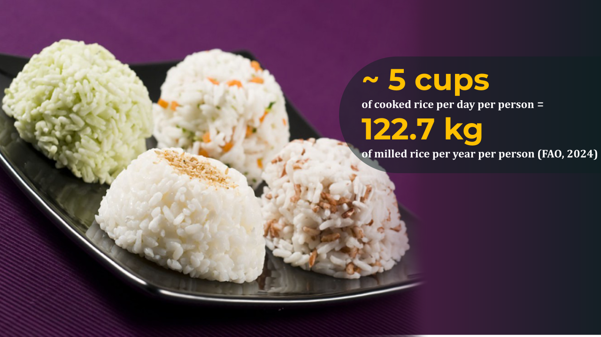{width="100%"}

## Value of Rice Production in the Philippines, 2000-2025 {.tiny-text}

```{r}
#| label: gva
#| echo: false

library(tidyverse)
library(plotly)
library(daclakeapi)

# Fetch data
key <- "l0iGmNpfrLp7eu5M1wlrPzFB4i9UccNS8GVgX3ZN"

gva_data <- data_api(url="https://ricelytics.philrice.gov.ph/data_lake/api/dynamic/kpi_value",
                      key = key) |> 
  filter(locCode == "999") |> 
  select(year, palayValue, agriValue) |> 
  mutate( palayValue = as.numeric(palayValue),
          agriValue  = as.numeric(agriValue),
          gva = (palayValue/1000),
         share = palayValue/agriValue)
  
# gva_data <- read_csv("gva.csv")

gva_data <- gva_data %>%
  mutate(
    gva = gva,
    share_pct = share * 100, 
    gva_label = paste("GVA:", formatC(gva, format = "f", digits = 0), "B"),
    share_label = paste0("Share to Agriculture: ", round(share_pct, 1), "%")
  )

gva_plot <- plot_ly(width=1000,
        height = 600)

gva_plot <- gva_plot %>%
  add_bars(
    data = gva_data,
    x = ~year,
    y = ~gva,
    name = "GVA",
    marker = list(color = "darkblue"),
    text = ~gva_label,
    hoverinfo = "text",
    textposition = "none"
  )

gva_plot <- gva_plot %>%
  add_lines(
    data = gva_data,
    x = ~year,
    y = ~share_pct,
    name = "Share to Agriculture",
    yaxis = "y2",
    line = list(color = "darkorange", width = 3),
    text = ~share_label,
    hoverinfo = "text"
  )

gva_plot <- gva_plot %>%
  layout(
    xaxis = list(
      title = "",
      tickangle = 0,
      tickfont = list(size = 12),
      automargin = TRUE
      # rangeslider = list(visible = TRUE)
    ),
    yaxis = list(
      title = "In billion (pesos)",
      tickformat = ".0f"
    ),
    yaxis2 = list(
      title = "Share (%)",
      overlaying = "y",
      side = "right",
      tickvals = seq(0, 25, by = 5),
    ticktext = paste0(seq(0, 25, by = 5), "%"),
    tickfont = list(color = "black"),
    showgrid = FALSE,
  range = c(0, 25)
  ),
    legend = list(orientation = "h", x = 0.01, y = 1.05,
                   xanchor = "left",
                  yanchor = "bottom"),
    hovermode = "x unified",
    margin = list(b = 60, r = 80)
  ) %>%
  config(displayModeBar = FALSE)

gva_plot

```

## Share of Rice Production in GDP, 2000-2025 {.tiny-text}

```{r}
#| label: gdp
#| echo: false

library(tidyverse)
library(plotly)
library(daclakeapi)

# Fetch data
key <- "l0iGmNpfrLp7eu5M1wlrPzFB4i9UccNS8GVgX3ZN"

gdp_data <- data_api(url="https://ricelytics.philrice.gov.ph/data_lake/api/dynamic/kpi_value",
                      key = key) |> 
  filter(locCode == "999") |> 
  select(year, palayValue, gdpValue) |> 
  mutate( palayValue = as.numeric(palayValue),
          gdpValue  = as.numeric(gdpValue),
          gdp = (gdpValue/1000000),
         share = palayValue/gdpValue)


# gdp_data <- read_csv("gdp.csv")

gdp_data <- gdp_data %>%
  mutate(
    gdp = gdp,
    share_pct = share * 100, 
    gdp_label = paste("GDP:", formatC(gdp, format = "f", digits = 1), "T"),
    share_label = paste0("Share of Rice to GDP: ", round(share_pct, 1), "%")
  )

gdp_plot <- plot_ly(width=1000,
        height = 600)

gdp_plot <- gdp_plot %>%
  add_bars(
    data = gdp_data,
    x = ~year,
    y = ~gdp,
    name = "GDP",
    marker = list(color = "darkblue"),
    text = ~gdp_label,
    hoverinfo = "text",
    textposition = "none"
  )

gdp_plot <- gdp_plot %>%
  add_lines(
    data = gdp_data,
    x = ~year,
    y = ~share_pct,
    name = "Share to GDP",
    yaxis = "y2",
    line = list(color = "darkorange", width = 3),
    text = ~share_label,
    hoverinfo = "text"
  )

gdp_plot <- gdp_plot %>%
  layout(
    xaxis = list(
      title = "",
      tickangle = 0,
      tickfont = list(size = 12),
      automargin = TRUE
      # rangeslider = list(visible = TRUE)
    ),
    yaxis = list(
      title = "In trillion (pesos)",
      tickformat = ".0f"
    ),
    yaxis2 = list(
      title = "Share (%)",
      overlaying = "y",
      side = "right",
      tickvals = seq(0, 4, by = .5),
    ticktext = paste0(seq(0,4, by = .5), "%"),
    tickfont = list(color = "black"),
    showgrid = FALSE,
  range = c(0, 4)
  ),
    legend = list(orientation = "h", x = 0.01, y = 1.05,
                   xanchor = "left",
                  yanchor = "bottom"),
    hovermode = "x unified",
    margin = list(b = 60, r = 80)
  ) %>%
  config(displayModeBar = FALSE)

gdp_plot

```

## Total Number of Rice Farmers in the Philippines {.tiny-text}

::: {style="transform: scale(0.6); transform-origin: top left; width: 175%; height: 1000px;"}
<iframe src="http://192.168.10.72:3941/" width="175%" height="1000px" style="border: none;">

</iframe>
:::

# Supply

## Annual Palay Production in the Philippines, 1970-2025 {.tiny-text}

```{r}
#| label: rice_prod
#| echo: false
#| warning: false
#| message: false


psadata <-  readRDS("psadata.rds") |>
  mutate(LOCATION = if_else(str_detect(LOCATION, "MAGUINDANAO"), "MAGUINDANAO", LOCATION)) |> 
  group_by(LOCATION, eco_code, date, PERIOD_CODE, LOCATION_TYPE, YEAR, PERIOD) |>
  summarise(PRODUCTION = sum(PRODUCTION, na.rm = T),
            AREA_HARVESTED = sum(AREA_HARVESTED, na.rm = T))

psadata$AREA_HARVESTED[psadata$PERIOD_CODE == 3 & 
                         psadata$LOCATION_TYPE == "NATIONAL" &
                         psadata$eco_code == 3 & 
                         !is.na(psadata$eco_code) &
                         psadata$YEAR == 2012] <- 1526876.47

psadata$AREA_HARVESTED[psadata$PERIOD_CODE == 3 & 
                         psadata$LOCATION_TYPE == "NATIONAL" &
                         psadata$eco_code == 1 & 
                         !is.na(psadata$eco_code) &
                         psadata$YEAR == 2008] <- 4459977.00
psadata <-  psadata |> 
  mutate(YIELD = PRODUCTION / AREA_HARVESTED)


nat_annual_prod <- 
  psadata |> 
  filter(PERIOD_CODE==3) |>
  filter(!is.na(eco_code)) |>
  filter(LOCATION_TYPE=="NATIONAL") |> 
  select(LOCATION,eco_code,date,PRODUCTION:YIELD) |> 
  select(LOCATION, eco_code, date, PRODUCTION) |> 
  pivot_wider(
    names_from = eco_code,
    values_from = PRODUCTION
  ) |> 
  rename(
    `All Ecosystem` = `1`,
    `Irrigated` = `2`,
    `Rainfed` = `3`
  )


prod_plot <- 
  plot_ly(
    nat_annual_prod,
    x = ~ year(date),
    width = 1000,
    height = 600
  ) |> 
  add_trace(
    y = ~ `Rainfed`,
    marker = list(color = "#FC8A17"),
    name = "Rainfed",
    type = 'bar',
    text = ~paste0("Rainfed: ", formatC(
      `Rainfed`,
      format = "f",
      digits = 0,
      big.mark = ","
    )),
    hoverinfo = "text",
    textposition = "none"
  ) |> 
  add_trace(
    y = ~ `Irrigated`,
    marker = list(color = "#B85631"),
    name = "Irrigated",
    type = 'bar',
    text = ~paste0("Irrigated: ", formatC(
      `Irrigated`,
      format = "f",
      digits = 0,
      big.mark = ","
    )),
    hoverinfo = "text",
    textposition = "none"
  ) |> 
  add_trace(
    y = ~ `All Ecosystem`,
    line = list(color = '#2138B7'),
    name = "All Ecosystem",
    type = "scatter",
    mode = "line",
    text = ~paste0("All Ecosystem: ", formatC(
      `All Ecosystem`,
      format = "f",
      digits = 0,
      big.mark = ","
    )),
    hoverinfo = "text",
    textposition = "none"
  ) |> 
  layout(
    xaxis = list(title = "Year",
                 rangeslider = list(visible = TRUE)
                 ),
    yaxis = list(title = "Area Harvested (ha)"),
    barmode = "stack"
  )


prod_plot |> 
    layout(
    # title =  "Annual National Production (1970 - Present)",
    yaxis = list(title = "Production (mt)"),
    hovermode = 'x unified',
    xaxis = list(title = "Year"),
    legend = list(x = 0.05, y = 0.95),
    margin = list(r = 80),
    hovermode = 'x unified'
    ) |> 
    config(displayModeBar=FALSE)

```

## 2025 Palay Production {.tiny-text}

:::::::::::::::::: columns
:::::::::::::::: {.column width="30%"}
```{r}
#|label: tot_prod

prod_natl <- 
psadata |> 
  filter(YEAR==2025 ) |> 
  filter(LOCATION_TYPE=="NATIONAL") |> 
  filter(PERIOD=="ANNUAL") |> 
  mutate(PRODUCTION = round(PRODUCTION/1000000,digits = 2))

prod_natl_alleco<- prod_natl |> 
  filter(eco_code==1) |> 
  pull(PRODUCTION)

prod_natl_irr<- prod_natl |> 
  filter(eco_code==2) |> 
  pull(PRODUCTION)

prod_natl_rain<- prod_natl |> 
  filter(eco_code==3) |> 
  pull(PRODUCTION)


```

::::::::::::::: flex-row
:::::: {.value-box .blue}
::: value-title
All Ecosystem
:::

::: value-number
`r prod_natl_alleco`
:::

::: value-subtitle
Million MT
:::
::::::

:::::: {.value-box .green}
::: value-title
Irrigated
:::

::: value-number
`r prod_natl_irr`
:::

::: value-subtitle
Million MT
:::
::::::

:::::: {.value-box .orange}
::: value-title
Rainfed
:::

::: value-number
`r prod_natl_rain`
:::

::: value-subtitle
Million MT
:::
::::::
:::::::::::::::
::::::::::::::::

::: {.column width="70%"}
```{r}
#| label: prodmap2
#| echo: false

psa_prov2025 <- 
psadata |> 
  filter(YEAR==2025) |> 
  filter(LOCATION_TYPE=="PROVINCE") |> 
  filter(PERIOD=="ANNUAL") |> 
  filter(eco_code==1) |> 
  mutate(location2 = if_else(LOCATION == "COTABATO",
                             "north cotabato",
                             clean_location(LOCATION))
  )

psa_prodmap <- 
province_map |>
  left_join(psa_prov2025,
            by=c("location"="location2"))


prod_pal <- colorBin(palette =c("#FF7F00",
                                "#FFD92F",
                                "#4DAF4A",
                                "#1F78B4"),
                        na.color = "white",
                        domain = psa_prodmap$PRODUCTION[psa_prodmap$PRODUCTION>0], 
                        bins = c(0,51000,110000,310000,Inf))

psa_prodmap <- 
  psa_prodmap |> 
  mutate(color = if_else(PRODUCTION==0, "grey",
                         prod_pal(PRODUCTION)))

labels_prod <- sprintf(
  "Province: %s<br>Production: %s mt",
  str_to_title(psa_prodmap$location),
  formatC(
    psa_prodmap$PRODUCTION,
    format = "f",
    digits = 0,
    big.mark = ","
  )
) %>%
  lapply(htmltools::HTML)


# Plot the map
leaflet(psa_prodmap,
        width = 700,
        height = 600) %>%
  addProviderTiles("CartoDB.VoyagerNoLabels",
                   options = providerTileOptions(minZoom =5)) %>%
  setView(lng = 121.7740+1, lat = 12.8797, zoom = 6) |> 
  addPolygons(
    fillColor =~color,
    fillOpacity = 1,
    weight = 1,
    opacity = 1,
    color = "black",
    highlight = highlightOptions(weight = 3, color = "#666", fillOpacity = 0.7),
    label = labels_prod
  ) %>%
    addLegend(pal = prod_pal, 
              values = ~PRODUCTION, 
              title = htmltools::HTML("Annual Palay Production in all ecosystems <br>by province in mt"),
              
              opacity = 0.7,
              labFormat = function(type, cuts, p) {
                c("<51,000", 
                  "51,000 - 110,000", 
                  "110,000 - 310,000", 
                  "> 310.000")  # matches the bins
              },
              na.label = "No production") |> 
    addControl(
    html = "<div style='font-size: 12px;font-style: italic;'>Source:<br>PSA</div>",
    position = "bottomleft"
  )


```
:::
::::::::::::::::::

## Annual Rice Area Harvested in the Philippines, 1970-2025 {.tiny-text}

```{r}
#| label: ann_area
#| echo: false
#| warning: false
#| message: false


nat_annual_area <- 
  psadata |> 
  filter(PERIOD_CODE==3) |>
  filter(!is.na(eco_code)) |>
  filter(LOCATION_TYPE=="NATIONAL") |> 
  select(LOCATION,eco_code,date,PRODUCTION:YIELD) |> 
  select(LOCATION, eco_code, date, AREA_HARVESTED) |> 
  pivot_wider(
    names_from = eco_code,
    values_from = AREA_HARVESTED
  ) |> 
  rename(
    `All Ecosystem` = `1`,
    `Irrigated` = `2`,
    `Rainfed` = `3`
  )


area_plot <- 
  plot_ly(
    nat_annual_area,
    x = ~ year(date),
    width = 1000,
    height = 600
  ) |> 
  add_trace(
    y = ~ `Rainfed`,
    marker = list(color = "#FC8A17"),
    name = "Rainfed",
    type = 'bar',
    text = ~paste0("Rainfed: ", formatC(
      `Rainfed`,
      format = "f",
      digits = 0,
      big.mark = ","
    )),
    hoverinfo = "text",
    textposition = "none"
  ) |> 
  add_trace(
    y = ~ `Irrigated`,
    marker = list(color = "#B85631"),
    name = "Irrigated",
    type = 'bar',
    text = ~paste0("Irrigated: ", formatC(
      `Irrigated`,
      format = "f",
      digits = 0,
      big.mark = ","
    )),
    hoverinfo = "text",
    textposition = "none"
  ) |> 
  add_trace(
    y = ~ `All Ecosystem`,
    line = list(color = '#2138B7'),
    name = "All Ecosystem",
    type = "scatter",
    mode = "line",
    text = ~paste0("All Ecosystem: ", formatC(
      `All Ecosystem`,
      format = "f",
      digits = 0,
      big.mark = ","
    )),
    hoverinfo = "text",
    textposition = "none"
  ) |> 
  layout(
    xaxis = list(title = "Year",
                 rangeslider = list(visible = TRUE)
                 ),
    yaxis = list(title = "Area Harvested (ha)"),
    barmode = "stack"
  )


area_plot |> 
    layout(
    # title =  "National Annual Area Harvested (1970 - Present)",
    yaxis = list(title = "Area Harvested (ha)"),
    hovermode = 'x unified',
    xaxis = list(title = "Year"),
    legend = list(x = 0.05, y = 0.95),
    margin = list(r = 80)
    ) |> 
    config(displayModeBar=FALSE)


```

## 2025 Rice Area Harvested {.tiny-text}

:::::::::::::::::: columns
:::::::::::::::: {.column width="30%"}
```{r}
#|label: area_overall

area_natl <- 
psadata |> 
  filter(YEAR==2025) |> 
  filter(LOCATION_TYPE=="NATIONAL") |> 
  filter(PERIOD=="ANNUAL") |> 
  mutate(AREA_HARVESTED = round(AREA_HARVESTED,digits = 2))

area_natl_alleco<- area_natl |> 
  filter(eco_code==1) |> 
  mutate(AREA_HARVESTED = round(AREA_HARVESTED/1000000,2)) |> 
  pull(AREA_HARVESTED)

area_natl_irr<- area_natl |> 
  filter(eco_code==2) |> 
  mutate(AREA_HARVESTED = round(AREA_HARVESTED/1000000,2)) |> 
  pull(AREA_HARVESTED)

area_natl_rain<- area_natl |> 
  filter(eco_code==3) |> 
  mutate(AREA_HARVESTED = round(AREA_HARVESTED/1000000,2)) |> 
  pull(AREA_HARVESTED)


```

::::::::::::::: flex-row
:::::: {.value-box .blue}
::: value-title
All Ecosystem
:::

::: value-number
`r area_natl_alleco`
:::

::: value-subtitle
million hectare
:::
::::::

:::::: {.value-box .green}
::: value-title
Irrigated
:::

::: value-number
`r area_natl_irr`
:::

::: value-subtitle
million hectare
:::
::::::

:::::: {.value-box .orange}
::: value-title
Rainfed
:::

::: value-number
`r area_natl_rain`
:::

::: value-subtitle
million hectare
:::
::::::
:::::::::::::::
::::::::::::::::

::: {.column width="70%"}
```{r}
#| echo: false

yield_pal <- colorBin(palette =c("#E78A1F",
                                "#FDD49E",
                                "#66C2A5",
                                "#377EB8"),
                        na.color = "white",
                        domain = psa_prodmap$AREA_HARVESTED[psa_prodmap$AREA_HARVESTED>0], 
                        bins = c(0,12000,30000,77000,Inf))

psa_yldmap <- 
  psa_prodmap |> 
  mutate(color = if_else(AREA_HARVESTED==0, "grey",
                         yield_pal(AREA_HARVESTED)))

labels_yld <- sprintf(
  "Province: %s<br>Production: %s ha",
  str_to_title(psa_yldmap$location),
  formatC(
    psa_yldmap$AREA_HARVESTED,
    format = "f",
    digits = 0,
    big.mark = ","
  )
) %>%
  lapply(htmltools::HTML)

# Plot the map
leaflet(psa_yldmap,
        width = 700,
        height = 600) %>%
  addProviderTiles("CartoDB.VoyagerNoLabels",
                   options = providerTileOptions(minZoom =5)) %>%
  setView(lng = 121.7740+1, lat = 12.8797, zoom = 6) |> 
  addPolygons(
    fillColor =~color,
    fillOpacity = 1,
    weight = 1,
    opacity = 1,
    color = "black",
    highlight = highlightOptions(weight = 3, color = "#666", fillOpacity = 0.7),
    label = labels_yld
  ) %>%
    addLegend(pal = yield_pal, 
              values = ~AREA_HARVESTED, 
              title = htmltools::HTML("Annual Area Harvested of Palay<br> in all ecosystems, by province in ha"), 
              
              opacity = 0.7,
              labFormat = function(type, cuts, p) {
                c("<=12000", 
                  "12000 to 30000", 
                  "30000 to 77000", 
                  ">77000")  # matches the bins
              },
              na.label = "No production") |> 
    addControl(
    html = "<div style='font-size: 12px;font-style: italic;'>Source:<br>PSA</div>",
    position = "bottomleft"
  )


```
:::
::::::::::::::::::

## Annual Yield in the Philippines, 1970-2025 {.tiny-text}

```{r}
#| label: yield
#| echo: false
#| warning: false
#| message: false

nat_annual_yield <- 
  psadata |> 
  filter(PERIOD_CODE==3) |>
  filter(!is.na(eco_code)) |>
  filter(LOCATION_TYPE=="NATIONAL") |> 
  select(LOCATION,eco_code,date,PRODUCTION:YIELD) |> 
  select(LOCATION, eco_code, date, YIELD) |> 
  pivot_wider(
    names_from = eco_code,
    values_from = YIELD
  ) |> 
  rename(
    `All Ecosystem` = `1`,
    `Irrigated` = `2`,
    `Rainfed` = `3`
  )

yield_plot <- 
plot_ly(
  data = nat_annual_yield,
  x = ~ year(date),
  width = 1000,
  height = 600
) |> 
add_trace(
  y = ~`All Ecosystem`,
  type = "scatter",
  mode = "line+markers",
  name = 'All Ecosystem',
  line = list(color = "#2138B7"),
  marker = list(color = '#2138B7'),
  hoverinfo = "text",
  text = ~ paste0("All Ecosystem: ",
                  formatC(
                    `All Ecosystem`,
                    format = "f",
                    digits = 2,
                    big.mark = ","
                  )),
  textposition = "none"
) |> 
add_trace(
  y = ~`Irrigated`,
  type = "scatter",
  mode = "line+markers",
  name = 'Irrigated',
  line = list(color = "#B85631"),
  marker = list(color = '#B85631'),
  hoverinfo = "text",
  text = ~ paste0("Irrigated: ",
                  formatC(
                    `Irrigated`,
                    format = "f",
                    digits = 2,
                    big.mark = ","
                  )),
  textposition = "none"
) |> 
add_trace(
  y = ~`Rainfed`,
  type = "scatter",
  mode = "line+markers",
  name = 'Rainfed',
  line = list(color = "#FC8A17"),
  marker = list(color = '#FC8A17'),
  hoverinfo = "text",
  text = ~ paste0("Rainfed: ",
                  formatC(
                    `Rainfed`,
                    format = "f",
                    digits = 2,
                    big.mark = ","
                  )),
  textposition = "none"
) 

yield_plot |> 
  layout(
    # title =  "National Annual Yield (1970 - Present)",
    xaxis = list(title = "Year",
                 rangeslider = list(visible = TRUE)
                 ),
    yaxis = list(title = "Yield (mt/ha)"),
    hovermode = 'x unified',
    xaxis = list(title = "Year"),
    legend = list(x = 0.05, y = 0.95),
    margin = list(r = 80)
    ) |> 
    config(displayModeBar=FALSE)

```

## 2025 Average Yield {.tiny-text}

:::::::::::::::::: columns
:::::::::::::::: {.column width="30%"}
```{r}
#|label: ave_yield

yld_natl <- 
psadata |> 
  filter(YEAR==2025) |> 
  filter(LOCATION_TYPE=="NATIONAL") |> 
  filter(PERIOD=="ANNUAL") |> 
  mutate(YIELD = round(YIELD,digits = 2))

yld_natl_alleco<- yld_natl |> 
  filter(eco_code==1) |> 
  pull(YIELD)

yld_natl_irr<- yld_natl |> 
  filter(eco_code==2) |> 
  pull(YIELD)

yld_natl_rain<- yld_natl |> 
  filter(eco_code==3) |> 
  pull(YIELD)


```

::::::::::::::: flex-row
:::::: {.value-box .blue}
::: value-title
All Ecosystem
:::

::: value-number
`r yld_natl_alleco`
:::

::: value-subtitle
metric tons per hectare
:::
::::::

:::::: {.value-box .green}
::: value-title
Irrigated
:::

::: value-number
`r yld_natl_irr`
:::

::: value-subtitle
metric tons per hectare
:::
::::::

:::::: {.value-box .orange}
::: value-title
Rainfed
:::

::: value-number
`r yld_natl_rain`
:::

::: value-subtitle
metric tons per hectare
:::
::::::
:::::::::::::::
::::::::::::::::

::: {.column width="70%"}
```{r}
#| echo: false


yield_pal <- colorBin(palette =c("#F1A63C",
                                "#FFF883",
                                "#29883E",
                                "#3B93E4",
                                "#B07AA1"),
                        na.color = "white",
                        domain = psa_prodmap$YIELD[psa_prodmap$YIELD>0], 
                        bins = c(0,3,4,5,6,Inf))

psa_yldmap <- 
  psa_prodmap |> 
  mutate(color = if_else(YIELD==0, "grey",
                         yield_pal(YIELD)))

labels_yld <- sprintf(
  "Province: %s<br>Production: %s mt/ha",
  str_to_title(psa_yldmap$location),
  formatC(
    psa_yldmap$YIELD,
    format = "f",
    digits = 2,
    big.mark = ","
  )
) %>%
  lapply(htmltools::HTML)

# Plot the map
leaflet(psa_yldmap,
        width = 700,
        height = 600) %>%
  addProviderTiles("CartoDB.VoyagerNoLabels",
                   options = providerTileOptions(minZoom =5)) %>%
  setView(lng = 121.7740+1, lat = 12.8797, zoom = 6) |> 
  addPolygons(
    fillColor =~color,
    fillOpacity = 1,
    weight = 1,
    opacity = 1,
    color = "black",
    highlight = highlightOptions(weight = 3, color = "#666", fillOpacity = 0.7),
    label = labels_yld
  ) %>%
    addLegend(pal = yield_pal, 
              values = ~YIELD, 
              title = htmltools::HTML("Annual Average Yield of Palay<br> in all ecosystems, by province in mt/ha"), 
              
              opacity = 0.7,
              labFormat = function(type, cuts, p) {
                c("<=3", 
                  "3 to 4", 
                  "4 to 5", 
                  "5 to 6",
                  ">6")  # matches the bins
              },
              na.label = "No production") |> 
    addControl(
    html = "<div style='font-size: 12px;font-style: italic;'>Source:<br>PSA</div>",
    position = "bottomleft"
  )


```
:::
::::::::::::::::::

## 

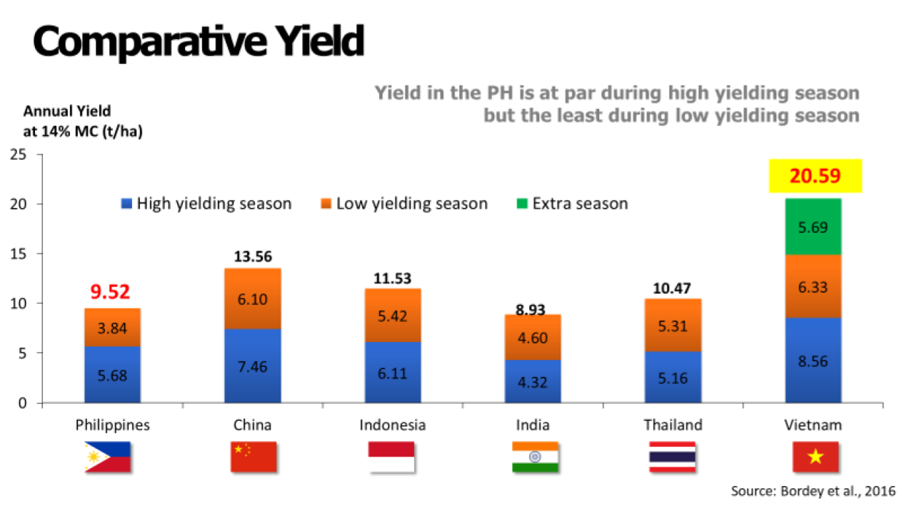{width="100%"}

## Production and Yield trends in the Philippines, 1970-2025 {.tiny-text}

```{r}
#| label: ann_prod
#| echo: false
#| warning: false
#| message: false

psadata <-  readRDS("psadata.rds")


nat_annual<- 
  psadata |> 
  filter(PERIOD_CODE==3) |> 
  filter(eco_code==1) |> 
  filter(LOCATION_TYPE=="NATIONAL") |> 
  select(LOCATION,eco_code,date,PRODUCTION:YIELD)


prod_plot <- 
plot_ly(nat_annual,
        x = ~year(date), 
        y = ~PRODUCTION,
        marker = list(color = "darkgreen"),
        name = "Total production (mt)",
        type = 'bar',
        width =1000,
        height=600,
        hovertemplate = paste("<b>Production:</b> %{y:,.0f} mt", "<extra></extra>")
) |> 
  layout(
         xaxis = list(title = "Year"
                      # rangeslider = list(visible = TRUE)
                      ),
         yaxis = list(title = "Production in MT"),
         barmode = "overlay")


prod_plot |> 
    add_lines(y=~YIELD, x=~year(date),
            name = "Average yield (mt/ha)",
            data = nat_annual,
            yaxis = 'y2',
            line = list(color = "darkorange", width = 4),
            marker = list(color= "orange"),
            hovertemplate = paste("<b>Yield:</b> %{y:.2f} mt/ha",
                                  "<extra></extra>")
            ) |>
    layout(
    # title =  "National Annual Production (1970 - Present)",
    yaxis = list(title = "Production (MT)"),
    yaxis2 = list(
      title = "Average yield (mt/ha)",
      overlaying = "y",
      side = "right",
      titlefont = list(size = 12),
      tickfont = list(size = 10),
      standoff = 20
    ),
    hovermode = 'x unified',
    xaxis = list(title = "Year"),
    legend = list(x = 0.05, y = 0.95),
    margin = list(r = 80)
    ) |> 
    config(displayModeBar=FALSE)
  
```

## Trends in Sources of Production Growth/Decline {.tiny-text}

```{r}
#| label: sopg
#| echo: false


sopg <-  read_csv("national_sopg.csv") |> 
  mutate(across(c(ps_area,ps_yield),
                ~(.*100))) |> 
  mutate(ps_area2 = case_when(
    prod_change_total>0 & ps_area<0 & ps_yield>0~0,
    prod_change_total>0 & ps_yield<0 & ps_area>0 ~1,
    prod_change_total<0 & ps_area>0 & ps_yield<0~0,
    prod_change_total<0 & ps_yield>0 & ps_area<0 ~1,
    .default = (ps_area/(ps_yield+ps_area))),
    ps_yield2 = case_when(
      prod_change_total>0 & ps_yield<0 & ps_area>0 ~0,
      prod_change_total>0 & ps_area<0 & ps_yield>0 ~1,
      prod_change_total<0 & ps_yield>0 & ps_area<0~0,
      prod_change_total<0 & ps_area>0 & ps_yield<0 ~1,
      .default = (ps_yield/(ps_yield+ps_area))
    ),
    prod_area_x = prod_change_total*ps_area2,
    prod_yield_x=prod_change_total*ps_yield2,
    area_perc = ps_area2*100,
    yield_perc = ps_yield2*100
  )


plot_ly(x=~Year,
        data = sopg, #|> filter(Year>2000),
        width=1000,
        height = 600) |> 
  add_bars(
    y = ~prod_area_x,
    marker = list(color = "darkorange"),
    name = "Production change due to area",
    type = 'bar',
    text = ~paste("% due to area:",round(area_perc), "%"),
    textposition="none",
    hoverinfo = 'text') |> 
  add_bars(
    y = ~prod_yield_x,
    marker = list(color = "brown"),
    name = "Production change due to yield",
    type = 'bar',
    text = ~paste("% due to yield:",round(yield_perc), "%"),
    textposition="none",
    hoverinfo = 'text') |>  
    add_lines(
    y = ~prod_change_total,
    line = list(color = "darkgreen"),
    marker = list(color = "darkgreen"),
    text = ~paste("Production Change:",format(round(prod_change_total),big.mark=","), "MT"),
    hoverinfo = 'text',
    name = "Year-on-Year Change in Production") |>
  layout(
    
    xaxis = list(title = "Year"
                 # rangeslider = list(visible = TRUE)
                 ),
    yaxis = list(title = "Volume in MT"),
    # hovermode = "x unified",
    barmode = "stack",
    legend = list(x = 0.05, y = 1,
                  bgcolor = 'rgba(255, 255, 255, 0.4)'),
    hovermode = 'x unified',
    xaxis = list(title = "Year")
  )|> 
    config(displayModeBar=FALSE)
  
    

```

## 

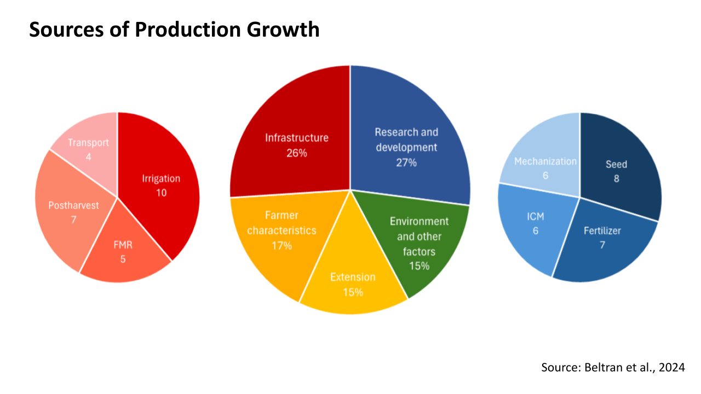{width="100%"}

## 

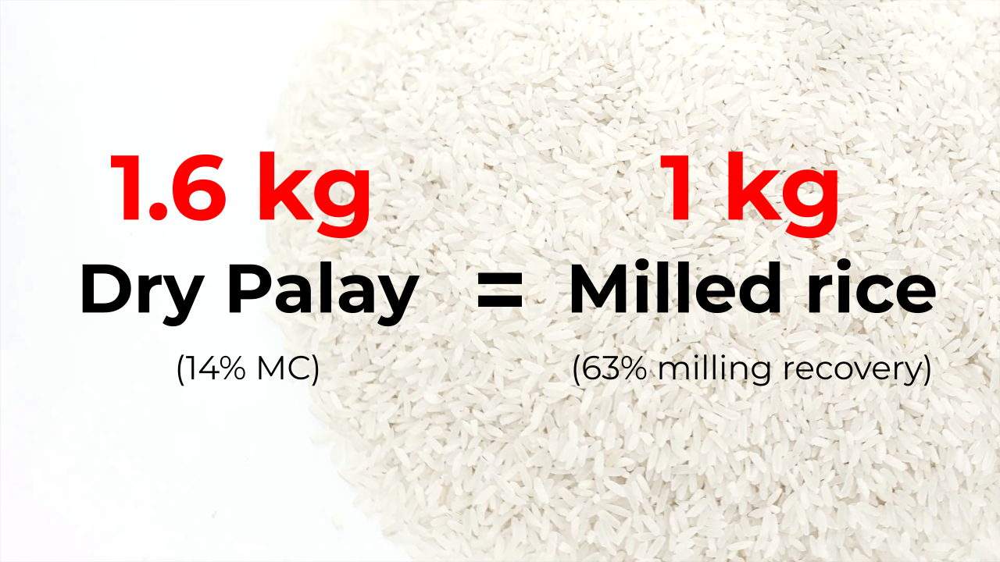{width="100%"}

## 

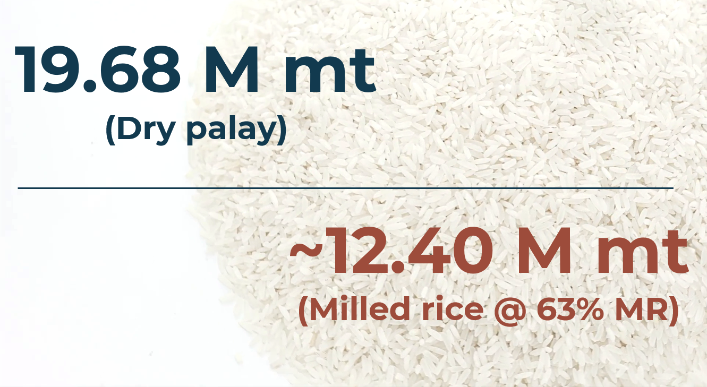{width="100%"}

## Total Volume of Rice Imports in the Philippines, 2000-2025 {.tiny-text}

```{r}
#| label: imports
#| echo: false

library(tidyverse)
library(plotly)
library(daclakeapi)

# Fetch data
key <- "l0iGmNpfrLp7eu5M1wlrPzFB4i9UccNS8GVgX3ZN"

imports_data <- data_api(url="https://ricelytics.philrice.gov.ph/data_lake/api/dynamic/kpi_sua",
                      key = key) |> 
  select(year, SUImports) |> 
  mutate(SUImports = as.numeric(SUImports),
         imports = SUImports/1000) |> 
  arrange(year) |> 
  filter(year >= "2000")

# # Load imports data
# imports_data <- read_csv("rice_imports.csv")

imports_data <- imports_data %>%
  mutate(imports = replace_na(imports, 0)) %>%
  mutate(formatted_imports = sprintf("%.2f", imports))

bar_color <- "darkblue"

imports_plot <- plot_ly(
  data = imports_data,
  width=1000,
        height = 600,
  x = ~year,
  y = ~imports,
  type = "bar",
  marker = list(color = bar_color),
  text = ~formatted_imports,
  hoverinfo = "text",
  textposition = "outside",
  textfont = list(
    family = "Roboto, sans-serif",
    color = "#031F0F"
  )
) %>%
  layout(
    # title = "In million metric tons ",
    xaxis = list(
      title = "Year",
      tickmode = "array",
      tickvals = imports_data$year,
      ticktext = imports_data$year
      # rangeslider = list(visible = TRUE)
    ),
    yaxis = list(
      title = "Volume of Rice Imports (million mt)",
      showticklabels = FALSE,
      showgrid = FALSE,
      zeroline = FALSE
    ),
    margin = list(r = 80),
    hovermode = 'x unified'
  ) %>%
  config(displayModeBar = FALSE)

imports_plot

```

# Demand

## Total Rice Utilization in the Philippines, 1990-2025 {.tiny-text}

```{r}
#| label: utilization
#| echo: false

library(tidyverse)
library(plotly)

# Load and clean data
rice_util <- read_csv("rice_utilization.csv")

# Rename for easier handling
rice_util <- rice_util |> 
  rename(
    FeedWastes = `Feed/Wastes`,
    NetFood = `Net Food Disposable`,
    Total = `Total Utilization`
  )

# Convert to long format for stacked bars
util_long <- rice_util |> 
  pivot_longer(
    cols = c(NetFood, Seeds, Processing, FeedWastes),
    names_to = "Category",
    values_to = "Value"
  )

colors <- c(
  "NetFood" = "#2ca02c",
  "FeedWastes" = "#ffe699",
  "Processing" = "#ffbb78",
  "Seeds" = "#98df8a"
)

category_labels <- c(
  "NetFood" = "Net Food Disposable",
  "Seeds" = "Seeds",
  "Processing" = "Processing",
  "FeedWastes" = "Feed/Wastes"
)

util_long <- util_long |> 
  mutate(Label = category_labels[Category])


util_plot <- plot_ly(width=1000,
        height = 600)

for (cat in names(colors)) {
  util_plot <- util_plot |> add_trace(
    data = util_long |> filter(Category == cat),
    x = ~Year,
    y = ~Value,
    type = 'bar',
    name = cat,
    marker = list(color = colors[cat]),
    text = ~paste0(Label, ": ", format(Value, big.mark = ",")),
    hoverinfo = 'text',
    textposition = "none" 
  )
}

util_plot <- util_plot |> add_lines(
  data = rice_util,
  x = ~Year,
  y = ~Total,
  name = "Total",
  line = list(color = "brown", width = 3),
  hoverinfo = "text",
  text = ~paste("Total:", Total)
)

util_plot<- util_plot |> layout(
  # title = "National Annual Rice Utilization (1990-2022)",
  barmode = "stack",
  yaxis = list(title = "Utilization (in '000 MT)",
               tickformat = ","),
  xaxis = list(title = "Year"
               # rangeslider = list(visible = TRUE)
               ),
  hovermode = 'x unified',
  legend = list(x = 0.05, y = 0.95),
  margin = list(r = 80)
) |> 
  config(displayModeBar = FALSE)

util_plot
```

## 

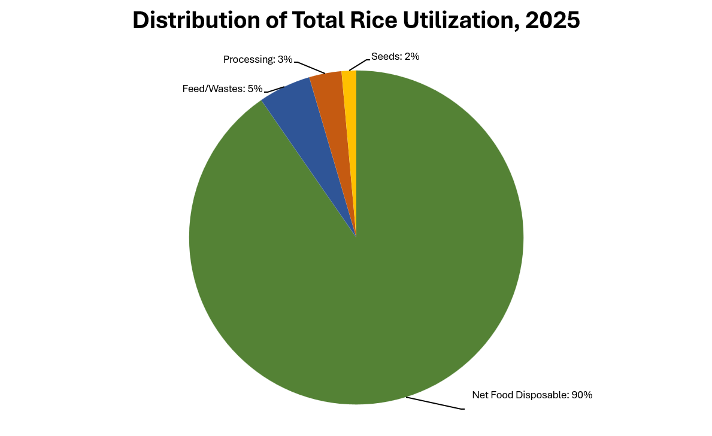{width="100%"}

## Rice Self-Sufficiency Ratio, 2000-2025 {.tiny-text}

```{r}
#| label: self_sufficiency
#| echo: false

library(tidyverse)
library(plotly)

# Load data
ss_data <- read_csv("self-sufficiency.csv")

ss_data <- ss_data %>%
  mutate(
    prod_mil = production,
    imp_mil = imports,
    ssr_pct = ssr * 100, 
    production_label = paste("Production:", format(prod_mil, digits = 2, nsmall = 2), "M MT"),
    imports_label = paste("Imports:", format(imp_mil, digits = 2, nsmall = 2), "M MT"),
    ssr_label = paste0("SSR: ", round(ssr_pct, 1), "%")
  )

ss_plot <- plot_ly(width=1000,
        height = 600)

ss_plot <- ss_plot %>%
  add_bars(
    data = ss_data,
    x = ~year,
    y = ~prod_mil,
    name = "Production",
    marker = list(color = "darkgreen"),
    text = ~production_label,
    hoverinfo = "text",
    textposition = "none"
  )

ss_plot <- ss_plot %>%
  add_bars(
    data = ss_data,
    x = ~year,
    y = ~imp_mil,
    name = "Imports",
    marker = list(color = "darkorange"),
    text = ~imports_label,
    hoverinfo = "text",
    textposition = "none"
  )

ss_plot <- ss_plot %>%
  add_lines(
    data = ss_data,
    x = ~year,
    y = ~ssr_pct,
    name = "Self-Sufficiency Ratio",
    yaxis = "y2",
    line = list(color = "brown", width = 3),
    text = ~ssr_label,
    hoverinfo = "text"
  )

ss_plot <- ss_plot %>%
  layout(
    barmode = "group",
    xaxis = list(
      title = "",
      tickangle = 0,
      tickfont = list(size = 12),
      automargin = TRUE,
      rangeslider = list(visible = TRUE)
    ),
    yaxis = list(
      title = "In million metric tons (M MT)",
      tickvals = seq(0, max(ss_data$prod_mil, ss_data$imp_mil, na.rm = TRUE) + 5, by = 5),
      tickformat = ".0f"
    ),
    yaxis2 = list(
      title = "Self-Sufficiency Ratio (%)",
      overlaying = "y",
      side = "right",
      tickvals = seq(0, 100, by = 10),
    ticktext = paste0(seq(0, 100, by = 10), "%"),
    tickfont = list(color = "black"),
    showgrid = FALSE,
  range = c(0, 100)
  ),
    legend = list(orientation = "h", x = 0.01, y = 1.05,
                   xanchor = "left",
                  yanchor = "bottom"),
    hovermode = "x unified",
    margin = list(b = 60, r = 80)
  ) %>%
  config(displayModeBar = FALSE)

ss_plot

```

-   *2023-2025 - NRP computed based on PSA data*.

## Provincial Rice Surplus and Deficit {.tiny-text}

::::: columns
::: {.column width="70%"}
```{r}
#| echo: false

sua_pre <- readRDS("sua_default.rds")

sua <- sua_pre$sua |> 
  filter(
    type == "prov" & 
      year == 2024 & 
      eco == "alleco"
  ) |> 
  mutate(
    fsi = SuffRatio / 100,
    util = Food + Seeds + Processing + Feeds_waste + totEndingStock,
    fsi_categ = cut(
      fsi,
      breaks = c(0, 0.5, 1, 1.25, Inf),
      labels = c(
        "Highly Deficient",
        "Deficient",
        "Marginally sufficient",
        "Sufficient"
      ),
      include.lowest = TRUE,
      ordered_result = TRUE
    ),
    sd = Imports
  )
  


sua_map <-
  province_map |>
  left_join(sua,
            by = c("location" = "location"))

numPal <- colorBin("RdYlBu",
                   domain = sua_map$SuffRatio,
                   bins = c(0, 50, 100, 125, Inf))

leaflet(
  width = 700,
  height = 600) %>%
    addProviderTiles("CartoDB.VoyagerNoLabels",
                   options = providerTileOptions(minZoom =5)) %>%
  setView(lng = 121.7740+1, lat = 12.8797, zoom = 6) |> 
  addPolygons(
    stroke = TRUE,
    fillOpacity = 0.9,
    fillColor = ~ numPal(SuffRatio),
    color = 'white',
    weight = 0.5,
    label = ~ paste(
      "<b> Province:</b>",
      str_to_title(province),
      "<br>",
      "<b> Rice Sufficiency Index </b>",
      round(SuffRatio, 2),
      "<br>",
      "<b> Category </b>",
      fsi_categ,
      "<br>",
      "<b> Surplus /Deficit </b>",
      format(round(sd, 0), big.mark = ",")
    ) %>%
      lapply(htmltools::HTML),
    labelOptions = labelOptions(
      style = list("font-weight" = "normal", padding = "3px 8px"),
      textsize = "13px",
      direction = "auto"
    ),
    data = sua_map
  ) %>%
  addLegend(
    colors =  c("#2C7BB6", "#ABD9E9", "#FDAE61", "#D7191C"),
    labels = c(
      "Sufficient (SSR>=125%)",
      "Marginally Sufficient (100%<=SSR<125%)",
      "Deficient (50%<=SSR<100)",
      "Highly Deficient (SSR<50%)"
    ),
    opacity = 0.9,
    title = 'Rice sufficiency Index',
    position = "topright",
    data = sua_map
  )
```
:::

::: {.column width="30%"}
```{r}
sua_categ <- sua |>
  group_by(fsi_categ) |> 
  count() |> 
  filter(!is.na(fsi_categ)) |> 
  mutate(
    color = case_when(
      fsi_categ == "Sufficient" ~ "#2C7BB6",
      fsi_categ == "Marginally sufficient" ~ "#ABD9E9",
      fsi_categ == "Deficient" ~ "#FDAE61",
      fsi_categ == "Highly Deficient" ~ "#D7191C"
    )
  )

sua_categ |> 
      arrange(fsi_categ) |> 
      plot_ly(labels = ~str_to_title(fsi_categ),
              width = 300,
              height = 300,
              values = ~n,
              type = "pie",
              hole = .4,
              direction = "clockwise",
              sort = FALSE,
              marker =list(colors = ~color),
              insidetextorientation = "horizontal",
              hovertemplate = ~paste("<b>Rice Self Sufficiency Level</b>: ", str_to_title(fsi_categ),
                                     "<br><b>Count</b>: ", n),
              texttemplate = "<b>%{value}<br>(%{percent})",
              name = "Rice Self Sufficiency Level",
              showlegend = FALSE) |> 
      layout(
        plot_bgcolor = "rgba(0,0,0,0)", # Transparent background
        paper_bgcolor = "rgba(0,0,0,0)" # Transparent background),

      )

```
:::
:::::

# Why can’t we produce enough rice?

## 

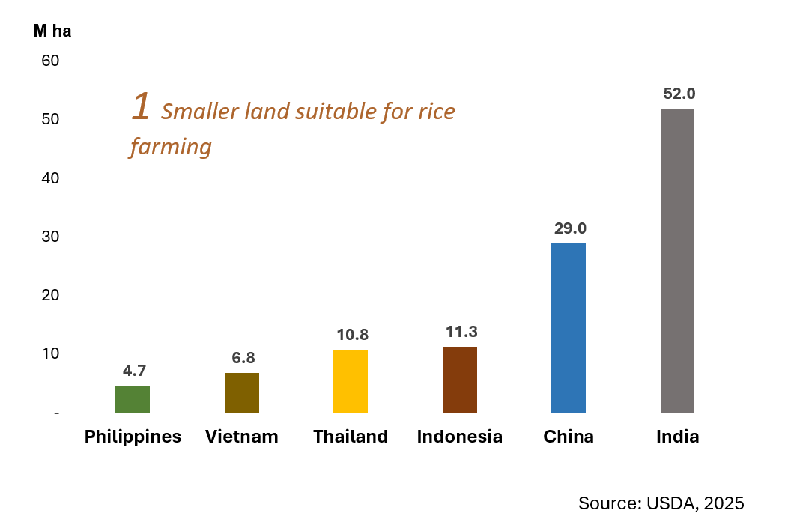{width="100%"}

## 

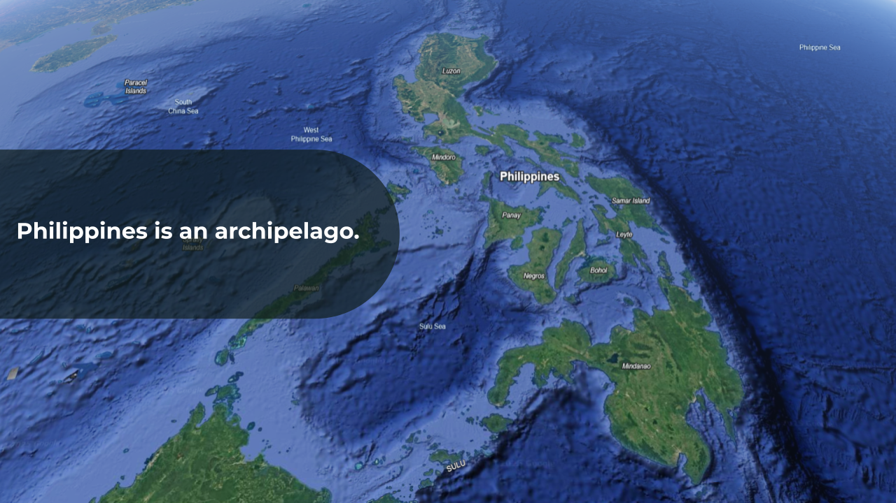{width="100%"}

## 

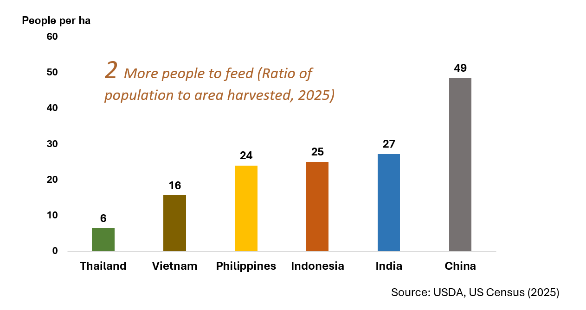{width="100%"}

## 

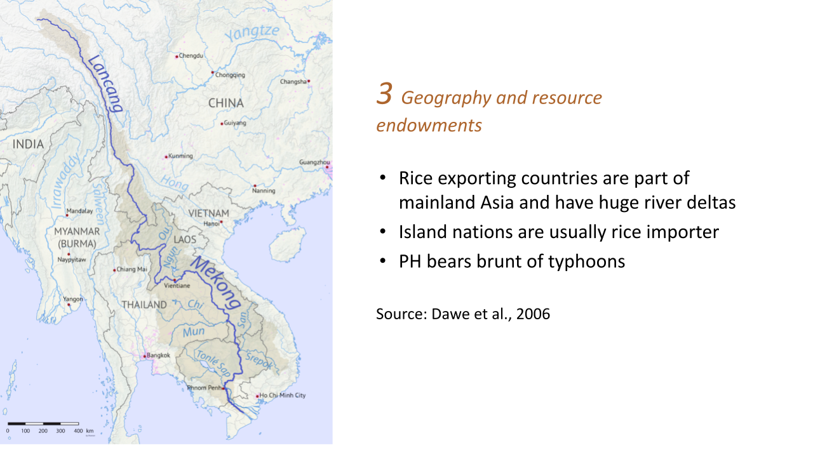{width="100%"}

## 

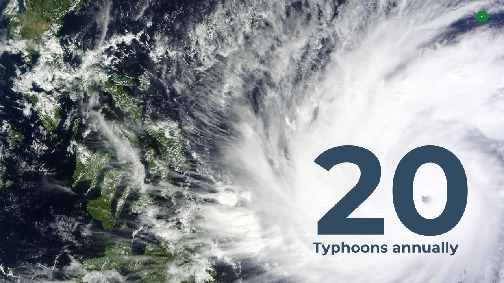{width="100%"}

## Typhoon Counts {.tiny-text}

```{r}
#| echo: false
#| fig-height: 12

library(leaflet)
library(dplyr)
library(readr)
library(sf)
library(lubridate)
library(stringr)
library(htmltools)

# 1. Province‐level typhoon counts for 2024
typhoon2024 <- read_csv(
  "typhoon_count_restructured_prov_long.csv",
  col_types = cols(
    LOCATION_TYPE = col_character(),
    PSGC_CODE     = col_character(),
    LOCATION      = col_character(),
    YEAR          = col_integer(),
    TC_COUNT      = col_double()
  )
) %>%
  filter(LOCATION_TYPE == "Province", YEAR == 2024) %>%
  group_by(PSGC_CODE, LOCATION) %>%
  summarize(typhoon_count = sum(TC_COUNT, na.rm = TRUE), .groups = "drop")

# 2. Join with province boundaries
prov_shapes <- readRDS("adminboundary_provincial(new).rds") %>%
  st_transform(crs = 4326) %>%
  rename(PSGC_CODE = PRO_CODE)

typhoon_map_data <- prov_shapes %>%
  left_join(typhoon2024, by = "PSGC_CODE") %>%
  mutate(typhoon_count = replace_na(typhoon_count, 0))

# 3. Create palette
vals <- typhoon_map_data$typhoon_count
raw_bins <- quantile(vals, probs = seq(0, 1, length.out = 5), na.rm = TRUE)
bins <- sort(unique(raw_bins))
if (length(bins) < 2) {
  bins <- c(0, max(vals, na.rm = TRUE) + 1)
}
pal <- colorBin(palette = "Blues", domain = vals, bins = bins, na.color = "white")

# 4. Hover labels for provinces
labels <- sprintf(
  "Province: %s<br>Typhoon Count (2024): %d",
  str_to_title(typhoon_map_data$LOCATION),
  typhoon_map_data$typhoon_count
) %>% lapply(HTML)

# 5. Typhoon track data for 2024
typhoon_track <- read_csv(
  "typhoon_track.csv",
  col_types = cols(
    NAME                   = col_character(),
    CLASSIFICATION         = col_character(),
    DATE_OF_OCCURRENCE   = col_character(),
    LATITUDE               = col_double(),
    LONGITUDE              = col_double()
  )
) %>%
  mutate(
    date = mdy(DATE_OF_OCCURRENCE),
    YEAR = year(date),
    LAT  = LATITUDE,
    LNG  = LONGITUDE
  ) %>%
  filter(YEAR == 2025)

# 6. Custom icons for each classification
iconList <- iconList(
  `Low Pressure Area` = makeIcon(
    iconUrl   = "typhoon icons/LPA.png",
    iconWidth = 20, iconHeight = 20
  ),
  `Tropical Depression` = makeIcon(
    iconUrl   = "typhoon icons/TD.png",
    iconWidth = 20, iconHeight = 20
  ),
  `Tropical Storm` = makeIcon(
    iconUrl   = "typhoon icons/S.png",
    iconWidth = 20, iconHeight = 20
  ),
  `Severe Tropical Storm` = makeIcon(
    iconUrl   = "typhoon icons/STS.png",
    iconWidth = 20, iconHeight = 20
  ),
  `Typhoon` = makeIcon(
    iconUrl   = "typhoon icons/T.png",
    iconWidth = 20, iconHeight = 20
  ),
  `Super Typhoon` = makeIcon(
    iconUrl   = "typhoon icons/ST.png",
    iconWidth = 20, iconHeight = 20
  )
)

# 7. Split tracks by NAME (ordered by date)
tracks_by_name <- typhoon_track %>%
  arrange(NAME, date) %>%
  split(.$NAME)

# 8. Boundary coordinates
PAR_coords <- list(
  matrix(c(115, 5, 115, 15, 120, 21, 120, 25, 135, 25, 135, 5, 115, 5),
         ncol = 2, byrow = TRUE)
)
TCAD_coords <- list(
  matrix(c(114, 4, 114, 27, 145, 27, 145, 4, 114, 4),
         ncol = 2, byrow = TRUE)
)
TCID_coords <- list(
  matrix(c(110, 0, 110, 27, 155, 27, 155, 0, 110, 0),
         ncol = 2, byrow = TRUE)
)

# 9. Build the Leaflet map step by step
m <- leaflet(typhoon_map_data) %>%
  addProviderTiles("CartoDB.VoyagerNoLabels", options = providerTileOptions(minZoom = 3)) %>%
  setView(lng = 122.0, lat = 12.0, zoom = 5)

# 9a. Add province polygons
m <- m %>%
  addPolygons(
    fillColor    = ~pal(typhoon_count),
    weight       = 1,
    opacity      = 1,
    color        = "black",
    dashArray    = "3",
    fillOpacity  = 0.7,
    highlight    = highlightOptions(weight = 3, color = "#666", fillOpacity = 0.7),
    label        = labels,
    group        = "Typhoon Counts"
  ) %>%
  addLegend(
    pal        = pal,
    values     = ~typhoon_count,
    position   = "bottomright",
    title      = htmltools::HTML("Typhoon Count (2024)"),
    opacity    = 0.7,
    labFormat  = function(type, cuts, p) {
      if (length(bins) == 2) {
        c("0", paste0("≥", bins[2]))
      } else {
        c(
          paste0("<", round(bins[2])),
          paste0(round(bins[2]), "–", round(bins[3])),
          paste0(round(bins[3]), "–", round(bins[4])),
          paste0("≥", round(bins[4]))
        )
      }
    },
    na.label   = "0"
  )

# 9b. Add typhoon track markers
m <- m %>%
  addMarkers(
    data    = typhoon_track,
    lat     = ~LAT,
    lng     = ~LNG,
    icon    = ~iconList[CLASSIFICATION],
    label   = ~paste0(
      "<strong>", NAME, "</strong><br/>",
      "Classification: ", CLASSIFICATION, "<br/>",
      "Date: ", date
    ) %>% lapply(htmltools::HTML),
    group   = "Typhoon Tracks"
  )

# 9c. Add typhoon track polylines
for (nm in names(tracks_by_name)) {
  df_track <- tracks_by_name[[nm]]
  m <- m %>%
    addPolylines(
      data         = df_track,
      lng          = ~LNG,
      lat          = ~LAT,
      color        = "red",
      weight       = 2,
      opacity      = 0.7,
      group        = "Typhoon Tracks",
      label        = paste0("<strong>", nm, "</strong>") %>% lapply(htmltools::HTML),
      labelOptions = labelOptions(
        direction = "auto",
        textsize  = "12px",
        offset    = c(0, 0),
        opacity   = 0.9,
        style     = list("background-color" = "rgba(255,255,255,0.85)", "padding" = "3px")
      )
    )
}

# 9d. Add PAR, TCAD, TCID boundaries
m <- m %>%
  addPolylines(
    lng       = PAR_coords[[1]][,1],
    lat       = PAR_coords[[1]][,2],
    color     = "red",
    weight    = 2,
    dashArray = "5,5",
    group     = "Typhoon Tracks",
    label     = "PAR Boundary",
    popup     = "Philippine Area of Responsibility (PAR)"
  ) %>%
  addPolylines(
    lng       = TCAD_coords[[1]][,1],
    lat       = TCAD_coords[[1]][,2],
    color     = "blue",
    weight    = 2,
    dashArray = "5,5",
    group     = "Typhoon Tracks",
    label     = "TCAD Boundary",
    popup     = "Tropical Cyclone Advisory Domain (TCAD)"
  ) %>%
  addPolylines(
    lng       = TCID_coords[[1]][,1],
    lat       = TCID_coords[[1]][,2],
    color     = "green",
    weight    = 2,
    dashArray = "5,5",
    group     = "Typhoon Tracks",
    label     = "TCID Boundary",
    popup     = "Tropical Cyclone Information Domain (TCID)"
  ) %>%
  addLegend(
    position = "bottomright",
    colors   = c("red", "blue", "green"),
    labels   = c("PAR Boundary", "TCAD Boundary", "TCID Boundary"),
    title    = "Boundaries",
    group    = "Typhoon Tracks",
    layerId  = "boundary_legend"
  )

# 9e. Add Layers control and source attribution
m <- m %>%
  addLayersControl(
    overlayGroups = c("Typhoon Counts", "Typhoon Tracks"),
    options       = layersControlOptions(collapsed = FALSE)
  ) %>%
  addControl(
    html     = "<div style='font-size:12px;font-style:italic;'>Source:<br>PRiSM Typhoon Counts (2024) & Tracks (2025)</div>",
    position = "bottomleft"
  )

# 10. Print the map
m


```

# Cost of producing rice in the Philippines

## Average Cost and Returns of Palay Production, 2002-2025 {.tiny-text}

```{r}
#| label: avg_cost_returns

library(readxl)

nat_creturn <- read_excel("kpi_creturns.xlsx") |> 
  filter(locType == 2, locCode == 999, eco == 2, season == 3) |> 
  arrange(year) |> 
  select(year, net_returns, cost_production, gross_returns)|> 
  filter(year != 2023) |> 
  bind_rows(
    data.frame(
      year = c(2023, 2024, 2025),
      net_returns = c(26423, 36211, 17110),
      cost_production = c(56491, 59695, 56235),
      gross_returns = c(82914, 95906, 73346 )
    )
  )


creturn_plot <- 
  plot_ly(
    data = nat_creturn,
    x = ~year,
    width = 1000,
    height = 600
  ) |> 
  add_trace(
    y = ~net_returns,
    marker = list(color = "#FC8A17"),
    name = "Net Return",
    type = 'bar',
    text = ~paste0("Net Return: ", 
                   formatC(
                     net_returns, 
                     format = "f", 
                     digits = 0, 
                     big.mark = ",")),
    hoverinfo = "text",
    textposition = "none"
  ) |> 
  add_trace(
    y = ~cost_production,
    marker = list(color = "#B85631"),
    name = "Production Cost",
    type = 'bar',
    text = ~paste0("Production Cost: ", 
                   formatC(cost_production, format = "f", digits = 0, big.mark = ",")),
    hoverinfo = "text",
    textposition = "none"
  ) |> 
  add_trace(
    y = ~gross_returns,
    line = list(color = "#2138B7", width = 2),
    name = "Gross Return",
    type = "scatter",
    mode = "line",
    text = ~paste0("Gross Return: ", 
                   formatC(gross_returns, format = "f", digits = 0, big.mark = ",")),
    hoverinfo = "text",
    textposition = "none"
  ) |> 
  layout(
    xaxis = list(
      title = "Year",
      rangeslider = list(visible = TRUE)
    ),
    yaxis = list(
      title = "Amount (PHP)"
    ),
    barmode = "stack"
  )


creturn_plot |> 
    layout(
    # title   = "Average Cost and Returns of Palay Production in the Philippines, 2002–2023",
    yaxis   = list(title = "Amount (PHP)"),
    hovermode = "x unified",
    xaxis   = list(title = "Year"),
    legend  = list(x = 0.05, y = 0.95),
    margin  = list(r = 80)
  ) |> 
  config(displayModeBar = FALSE)


```

## 

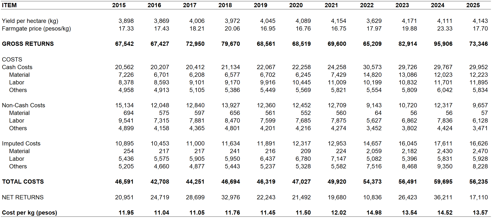{width="100%"}

## 

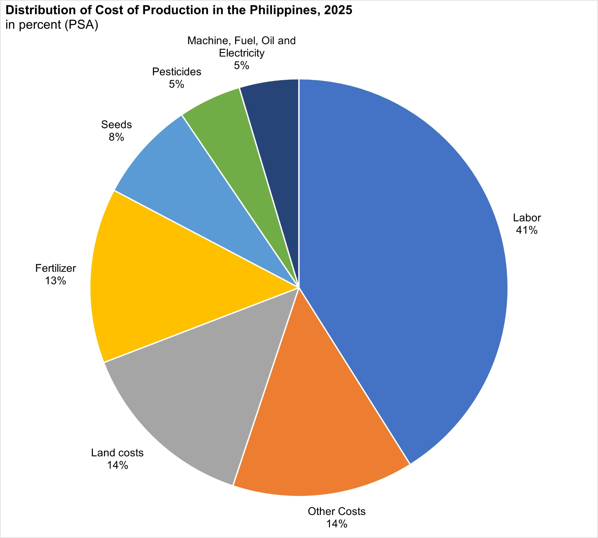{width="100%"}

## 

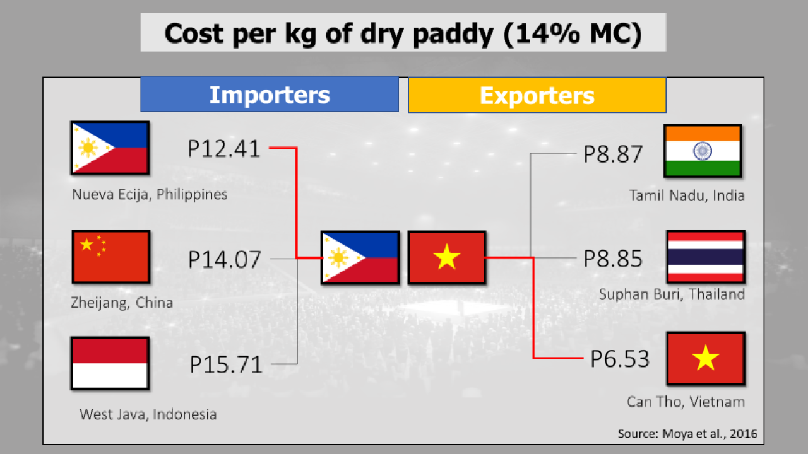{width="100%"}

## 

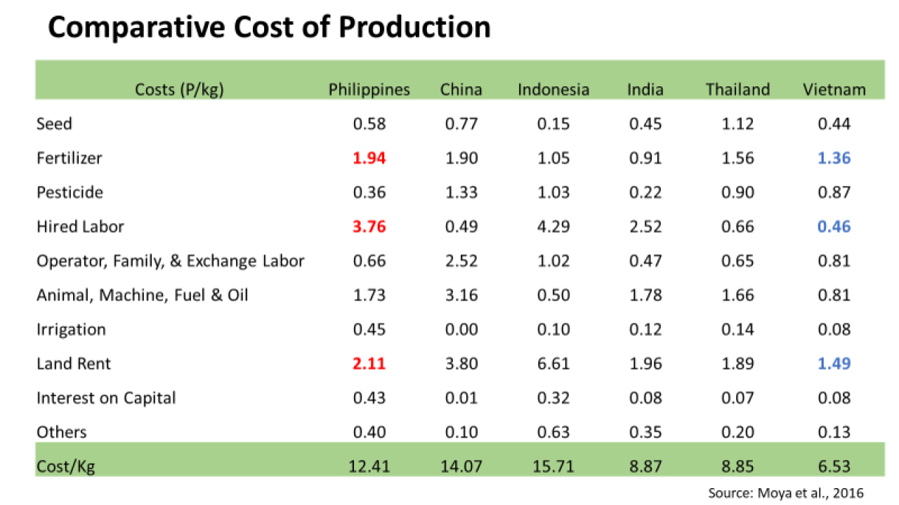{width="100%"}

## 

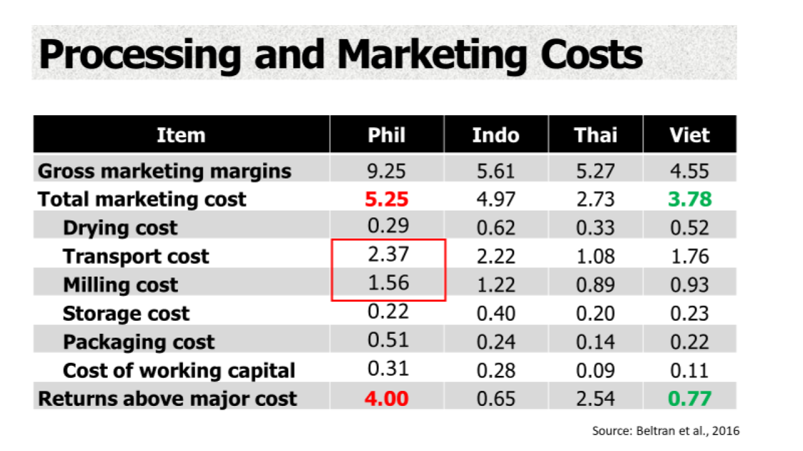{width="100%"}

# Rice Prices

## Quarterly Palay Prices (14% MC), 2010-Present {.tiny-text}

```{r}
#| echo: false
library(openxlsx)
library(tidyverse)


# Fetch data
key.gatchie <- "0qcGQLvf2sImP9WqOK6hMjZntrlRlLsyz05oYlEo"


wholesale.price <- data_api(
  url = "https://ricelytics.philrice.gov.ph/data_lake/api/dynamic/analyticsapi_wholesale_prices", 
  key = key.gatchie) |> 
  select(monthyr, wmr, rmr)


retail.price <- data_api(
  url = "https://ricelytics.philrice.gov.ph/data_lake/api/dynamic/analyticsapi_retail_prices",
  key = key.gatchie) |> 
  select(monthyr, wmr, rmr)

farmgate.price <- data_api(
  url = "https://ricelytics.philrice.gov.ph/data_lake/api/dynamic/analyticsapi_farmgate_prices",
  key = key.gatchie) |> 
  select(monthyr, farmgate)


# merge into one dataset
riceprices.api<- wholesale.price |>
  full_join(retail.price, by = "monthyr", suffix = c("_wholesale", "_retail")) |>
  full_join(farmgate.price, by = "monthyr")


riceprices.api <- riceprices.api |>
  mutate(
    year  = year(monthyr),
    month = month(monthyr)
  ) |> 
  mutate(monthyr = as.Date(monthyr, format = "%m/%d/%Y"))|>
  mutate(
    year  = lubridate::year(monthyr),
    month = lubridate::month(monthyr)
  ) |> 
    mutate(month = month(monthyr, label = TRUE)) |> 
  select(year, month, everything(), -monthyr)


xriceprice.api <- riceprices.api |> 
  mutate(date = ymd(paste(year, month,"1",sep="-")),
         yr = year(date),
         mth = month(date),
         qtr = quarter(date),
         sem = semester(date))
  


xriceprice.api <- xriceprice.api |>
  pivot_longer(
    cols = c(wmr_wholesale, rmr_wholesale, wmr_retail, rmr_retail, farmgate),
    names_to = "type",
    values_to = "price"
  ) |> 
  mutate(price = as.numeric(price))

xriceprice.api_QTR <- 
xriceprice.api |> 
  filter(yr >=2010) |> 
  group_by(yr,qtr,type) |> 
  summarise_at(vars(price),
               list(mean=mean,min=min,max=max)) |> 
  ungroup() |> 
  mutate(quarterdate = ymd(paste(yr,qtr*3,1,sep="-")),
         quartertext = paste(yr,"Quarter",qtr))


# riceprices <-  readRDS("riceprices.rds")

# xriceprice <-
#   riceprices |>
#   filter(SERIES %in% c("New Series","2012-based","2018-based")) |>
#   filter(str_detect(COMMODITY,"WMR|RMR|Palay")) |>
#   filter(LOCATION=="PHILIPPINES") |>
#   mutate(date = ymd(paste(YEAR,PERIOD,"1",sep="-")),
#          yr = year(date),
#          mth = month(date),
#          qtr = quarter(date),
#          sem = semester(date))
# 
# xriceprice_QTR <-
# xriceprice |>
#   group_by(yr,qtr,TYPE,COMMODITY) |>
#   summarise_at(vars(PRICE),
#                list(mean=mean,min=min,max=max)) |>
#   ungroup() |>
#   mutate(quarterdate = ymd(paste(yr,qtr*3,1,sep="-")),
#          quartertext = paste(yr,"Quarter",qtr))
```

```{r}
#| label: farmgate
#| echo: false

plot_ly(x=~quarterdate,
        data = xriceprice.api_QTR |>
          filter(type=="farmgate" )
        ,
        width=1000,
        height = 600) |>
  add_lines(
    y = ~max,
    line = list(color = "transparent"),
    hoverinfo = 'none',
    showlegend = FALSE,
    name = "Highest Price") |>
  add_lines(
    y = ~min,
    line = list(color = "transparent"),
    fill = 'tonexty', fillcolor='rgba(0,100,80,0.2)',
    hoverinfo = 'none',
    showlegend = FALSE,
    name = "Lowest Price") |>

  add_trace(
    y = ~mean,
    type = 'scatter', mode = 'lines+markers',
    line = list(color = "darkgreen"),
    marker = list(color = "darkgreen"),
    text = ~paste("<b>",quartertext,"</b>",
                  "<br>Average: ₱",format(round(mean,digits = 2),big.mark=","),
                  "<br>Highest: ₱",round(max,digits=2),
                  "<br>Lowest: ₱", round(min,digits=2)),
    hoverinfo = 'text',
    name = "Average Farmgate Price (Dry)") |>
  layout(
    # title = "Average, Highest and Lowest Farmgate  Prices (Dry), by Quarter",
    xaxis = list(title = "Year and Quarter"
                 # rangeslider = list(visible = TRUE)
                 ),
    yaxis = list(title = "Pesos per kg (₱)"),
    hovermode = "x unified",
    # barmode = "stack",
    legend = list(x = 0.05, y = 1,
                  bgcolor = 'rgba(255, 255, 255, 0.4)')
    # hovermode = 'x unified'
  )|>
    config(displayModeBar=FALSE)


# plot_ly(x=~quarterdate,
#         data = xriceprice.api_QTR |> 
#           filter(str_detect(COMMODITY,"Palay \\(Other")),
#         width=1000,
#         height = 600) |> 
#   add_lines(
#     y = ~max,
#     line = list(color = "transparent"),
#     hoverinfo = 'none',
#     showlegend = FALSE,
#     name = "Highest Price") |>
#   add_lines(
#     y = ~min,
#     line = list(color = "transparent"),
#     fill = 'tonexty', fillcolor='rgba(0,100,80,0.2)',
#     hoverinfo = 'none',
#     showlegend = FALSE,
#     name = "Lowest Price") |>
# 
#   add_trace(
#     y = ~mean,
#     type = 'scatter', mode = 'lines+markers',
#     line = list(color = "darkgreen"),
#     marker = list(color = "darkgreen"),
#     text = ~paste("<b>",quartertext,"</b>",
#                   "<br>Average: ₱",format(round(mean,digits = 2),big.mark=","),
#                   "<br>Highest: ₱",round(max,digits=2),
#                   "<br>Lowest: ₱", round(min,digits=2)),
#     hoverinfo = 'text',
#     name = "Average Farmgate Price (Dry)") |>
#   layout(
#     # title = "Average, Highest and Lowest Farmgate  Prices (Dry), by Quarter",
#     xaxis = list(title = "Year and Quarter"
#                  # rangeslider = list(visible = TRUE)
#                  ),
#     yaxis = list(title = "Pesos per kg (₱)"),
#     hovermode = "x unified",
#     # barmode = "stack",
#     legend = list(x = 0.05, y = 1,
#                   bgcolor = 'rgba(255, 255, 255, 0.4)')
#     # hovermode = 'x unified'
#   )|> 
#     config(displayModeBar=FALSE)


```

## Quarterly Wholesale and Retail Prices, 2010-Present {.tiny-text}

```{r}
#| label: riceprice
#| echo: false


plot_ly(x = ~quarterdate,
        width = 1000,
        height = 600,
        data = xriceprice.api_QTR) |>
  add_trace(
    data =xriceprice.api_QTR |>
              filter(type == "wmr_wholesale" & yr >= 2012), 
            x = ~quarterdate ,
            y = ~mean,
            type = 'scatter',
            mode = 'lines',
            text = ~paste("<b>",quartertext,"</b>",
                          "<br> Wholesale - WMR: ₱", round(mean,digits=2)),
            hoverinfo = 'text',
            line = list(color ='darkgreen'),
            name = "Well Milled Rice (wholesale)") |>
#Wholesale RTR
  add_trace(
    data =xriceprice.api_QTR |>
              filter(type == "wmr_retail" & yr >= 2012),
        x = ~quarterdate,
        y = ~mean,
        type = 'scatter',
        mode = 'lines',
        text = ~paste("Retail - WMR: ₱", round(mean,digits=2)),
        hoverinfo='text',
        line = list(color ='darkgreen',
                    dash = "dash"),
        name = "Well Milled Rice (retail)") |>
  add_lines(
    data =xriceprice.api_QTR |>
      filter(type == "rmr_wholesale" & yr >= 2012), 
    y = ~mean,
    text = ~paste("Wholesale - RMR: ₱",round(mean,digits=2)),
    hoverinfo='text',
    line = list(color = "darkorange"),
    name = "Regular Milled Rice (wholesale)") |>
      add_lines(
    data =xriceprice.api_QTR |>
      filter(type == "rmr_retail" & yr >= 2012),
    y = ~mean,
    text = ~paste("Retail - RMR: ₱",round(mean,digits=2)),
    hoverinfo = 'text',
    line = list(color = "darkorange",
                dash = "dash"),
    name = "Regular Milled Rice (retail)") |>
  layout(
    # title = "Average Wholesale and Retail Rice  Prices, by Quarter",
    xaxis = list(title = "Year and Quarter"
                 # rangeslider = list(visible = TRUE)
                 ),
    yaxis = list(title = "Pesos per kg (₱)"),
    hovermode = "x unified",
    # barmode = "stack",
    legend = list(x = 0.05, y = 1,
                  bgcolor = 'rgba(255, 255, 255, 0.4)')
    # hovermode = 'x unified'
  )|>
    config(displayModeBar=FALSE)


# plot_ly(x=~quarterdate,
#         width=1000,
#         height = 600,
#         data=xriceprice_QTR) |> 
#   add_trace(data =xriceprice_QTR |> 
#               filter(str_detect(TYPE,"Wholesale")) |> 
#               filter(str_detect(COMMODITY,"WMR")) |> 
#               filter(yr>=2012),
#             x=~quarterdate,
#             y=~mean,
#             type = 'scatter',
#             mode = 'lines',
#             text = ~paste("<b>",quartertext,"</b>",
#                           "<br> Wholesale - WMR: ₱", round(mean,digits=2)),
#             hoverinfo='text',
#             line = list(color ='darkgreen'),
#             name = "Well Milled Rice (wholesale)") |> 
# #Wholesale RTR
#   add_trace(data =xriceprice_QTR |> 
#               filter(str_detect(TYPE,"Retail")) |> 
#               filter(str_detect(COMMODITY,"WMR")),
#             x=~quarterdate,
#         y=~mean,
#         type = 'scatter',
#         mode = 'lines',
#         text = ~paste("Retail - WMR: ₱", round(mean,digits=2)),
#         hoverinfo='text',
#         line = list(color ='darkgreen',
#                     dash = "dash"),
#         name = "Well Milled Rice (retail)") |> 
#   add_lines(
#     data =xriceprice_QTR |> 
#       filter(str_detect(TYPE,"Wholesale")) |> 
#       filter(str_detect(COMMODITY,"RMR")) |> 
#       filter(yr>=2012),
#     y = ~mean,
#     text = ~paste("Wholesale - RMR: ₱",round(mean,digits=2)),
#     hoverinfo='text',
#     line = list(color = "darkorange"),
#     name = "Regular Milled Rice (wholesale)") |>
#       add_lines(
#     data =xriceprice_QTR |> 
#       filter(str_detect(TYPE,"Retail")) |> 
#       filter(str_detect(COMMODITY,"RMR")),
#     y = ~mean,
#     text = ~paste("Retail - RMR: ₱",round(mean,digits=2)),
#     hoverinfo='text',
#     line = list(color = "darkorange",
#                 dash = "dash"),
#     name = "Regular Milled Rice (retail)") |>
#   layout(
#     # title = "Average Wholesale and Retail Rice  Prices, by Quarter",
#     xaxis = list(title = "Year and Quarter"
#                  # rangeslider = list(visible = TRUE)
#                  ),
#     yaxis = list(title = "Pesos per kg (₱)"),
#     hovermode = "x unified",
#     # barmode = "stack",
#     legend = list(x = 0.05, y = 1,
#                   bgcolor = 'rgba(255, 255, 255, 0.4)')
#     # hovermode = 'x unified'
#   )|> 
#     config(displayModeBar=FALSE)


```

## Monthly IPP, Wholesale, and Retail Prices, 2012-Present {.tiny-text}

```{r}
#| label: ipp
#| echo: false

library(tidyverse)
library(plotly)
library(daclakeapi)

#Fetch data
key <- "l0iGmNpfrLp7eu5M1wlrPzFB4i9UccNS8GVgX3ZN"

price <- get_api_data("wholesale_prices",
                      key) |> 
  rename_all(~str_remove_all(.,"data.")) |> 
  mutate(monthyr = mdy(monthyr))

fob <- get_api_data("fao_fob_prices",
                    key) |> 
  rename_all(~str_remove_all(.,"data.")) |> 
  mutate(monthyr = mdy(monthyr)) 

exrates <- get_api_data("exrates",
                        key) |> 
  rename_all(~str_remove_all(.,"data.")) |> 
  mutate(monthyr = mdy(monthyr)) 

retail <- get_api_data("retail_prices", key) %>%
  rename_all(~str_remove_all(.,"data.")) |> 
  mutate(monthyr = mdy(monthyr)) %>%
  rename(c(wmr2=wmr,
           rmr2=rmr))

farmgate <- get_api_data("farmgate_prices",
                         key) |> 
  rename_all(~str_remove_all(.,"data.")) |> 
  mutate(monthyr = mdy(monthyr))

tariff <- data_api(url = "https://ricelytics.philrice.gov.ph/data_lake/api/dynamic/analyticsapi_tariff",
                   key = key) |> 
  mutate(date = mdy(date)) |> 
  select(date, tariff)

#Merging into one dataset
merged_data <- left_join(fob, exrates, by = "monthyr") %>%
  left_join(price, by = "monthyr") %>%
  left_join(retail, by = "monthyr") %>%
  left_join(farmgate, by = "monthyr") %>%
  select(-starts_with("created")) %>%
  select(-starts_with("updated")) %>%
  select(-starts_with("id")) %>%
   select(-starts_with("status")) %>%
   select(-starts_with("table")) %>%
  arrange(desc(monthyr))

#Creating dataset for viet25
viet_data <- merged_data %>%
  filter(type == "Vietnam 25%") %>%
  left_join(tariff, by = c("monthyr" = "date")) %>%
  mutate(value = as.numeric(value),
         exrates = as.numeric(exrates),
         tariff = as.numeric(tariff),
         cif = value + 62.42,
         tariff_amount = cif * exrates * (1 + tariff),
         viet25 = (tariff_amount + 1443) / 1000
  ) %>%
  select(monthyr, viet25)

#Creating dataset for thai25
thai_data <- merged_data %>%
  filter(type == "Thai 25%") %>%
  left_join(tariff, by = c("monthyr" = "date")) %>%
  mutate(value = as.numeric(value),
         exrates = as.numeric(exrates),
         tariff = as.numeric(tariff),
         cif = value + 62.42,
         tariff_amount = cif * exrates * (1 + tariff),
         thai25 = (tariff_amount + 1443) / 1000
  ) %>%
  select(monthyr, thai25)

#Creating ipp_data
ipp_data <- merged_data %>%
  select(date = monthyr,
         ws_rmr = rmr,
         ret_rmr = rmr2) %>%
  distinct() %>%
  left_join(viet_data, by = c("date" = "monthyr")) %>%
  left_join(thai_data, by = c("date" = "monthyr")) |> 
  filter(date >= as.Date("2012-01-01"))

# Load data
# ipp_data <- read_csv("ipp.csv")

# # Fix the date format from "16-Jan" to actual Date object
# ipp_data <- ipp_data %>%
#   mutate(date = as.Date(paste0("01-", date), format = "%d-%y-%b"))

# Plot
plot_ly(ipp_data,
        width=1000,
        height = 600,
        x = ~date) %>%
  add_lines(y = ~viet25, name = "Vietnam 25%", 
            line = list(color = "forestgreen", 
                        width = 2)) %>%
  add_lines(y = ~thai25, name = "Thailand 25%", 
            line = list(color = "darkorange", 
                        width = 2)) %>%
  add_lines(y = ~ws_rmr, name = "Wholesale RMR", 
            line = list(color = "dodgerblue", 
                        width = 2)) %>%
  add_lines(y = ~ret_rmr, name = "Retail RMR", 
            line = list(color = "brown", 
                        width = 2)) %>%
  layout(
    xaxis = list(title = "Date"
                 # rangeslider = list(visible = TRUE)
                 ),
    yaxis = list(title = "Price (PHP/kg)", tickformat = ".2f"),
    legend = list(orientation = "h", x = 0.1, y = 1.1),
    hovermode = "x unified",
    margin = list(b = 60, t = 60)
  ) %>%
  config(displayModeBar = FALSE)

```

## Contribution of Rice to Headline Inflation, 2000-2025 {.tiny-text}

```{r}
#| label: inflation
#| echo: false

library(tidyverse)
library(plotly)
library(daclakeapi)
library(lubridate)

#Fetch data
key <- "l0iGmNpfrLp7eu5M1wlrPzFB4i9UccNS8GVgX3ZN"

inflation_data <- data_api2(url = "https://ricelytics.philrice.gov.ph/data_lake/api/dynamic/kpi_inflation",
                                              key = key)
saveRDS(inflation_data, "kpi_inflation.rds")

cpi <- readRDS("kpi_inflation.rds") |>
  filter(locCode == "999", itemType == "All Items", month != "13") |>
  mutate(date = mdy(paste(month, "01", year, sep = "-"))) |> 
  select(date, headline_cpi = cpi) |> 
  unique()

rice_inflation <- readRDS("kpi_inflation.rds") |>
  filter(locCode == "999", itemType == "Rice", month != "13") |>
  select(year, month, rice_cpi = cpi, rice_inf = yoyCpi) |> 
  unique()

headline_inflation <- readRDS("kpi_inflation.rds") |>
  filter(locCode == "999", itemType == "All Items", month != "13") |>
  select(year, month, headline_cpi = cpi, headline_inf = yoyCpi) |> 
  unique()

inflation <- rice_inflation |>
  left_join(headline_inflation, by = c("year", "month")) |>
  mutate(date = mdy(paste(month, "01", year, sep = "-")),
         Contri = (8.86892629 / 100) * rice_inf) |> 
  filter(date >= as.Date("2000-01-01"),
         date <= as.Date("2025-12-01")) |> 
  unique()

inf_data <- inflation |> 
  select(date, headline_inf, Contri) |> 
  mutate(year = year(date)) |> 
  group_by(year) |> 
  summarise(headline = mean(headline_inf, na.rm = TRUE),
            contri = mean(Contri, na.rm = TRUE),
            .groups = "drop")

# # Load data
# inf_data <- read_csv("inflation.csv")

inf_data <- inf_data %>%
  mutate(
    headline = headline,
    contri = contri,
    headline_label = paste("Headline Inflation:", round(headline, 1), "%"),
    contri_label = paste0("Contribution of Rice: ", round(contri, 1), "%"))

plot_ly(inf_data,
        width=1000,
        height = 600,
        x = ~year) %>%
  add_lines(y = ~headline, name = "Headline Inflation", 
            line = list(color = "forestgreen", 
                        width = 2),
            text = ~headline_label,
    hoverinfo = "text") %>%
  add_lines(y = ~contri, name = "Rice Contribution", 
            line = list(color = "darkorange", 
                        width = 2),
            text = ~contri_label,
    hoverinfo = "text") %>%
  layout(
    xaxis = list(title = "Year"
                 # rangeslider = list(visible = TRUE)
                 ),
    yaxis = list(title = "Percent (%)", tickformat = ".2f"),
    legend = list(orientation = "h", x = 0.1, y = 1.1),
    hovermode = "x unified",
    margin = list(b = 60, t = 60)
  ) %>%
  config(displayModeBar = FALSE)

```

# Outlook for 2026 and beyond

<!-- ## SUA projections {.tiny-text} -->

<!-- ::: tiny-text -->

<!-- ```{r} -->

<!-- #| label: sua projected -->

<!-- #| echo: false -->

<!-- ensemb_form <- readRDS("esembform.rds") -->

<!-- sua_ensemb<-  -->

<!-- ensemb_form[[".supply"]] %>% -->

<!--   filter(!(variables %in% c("Base Palay Production", -->

<!--                             "Total Calamity loss"))) %>%  -->

<!--   rbind(ensemb_form[[".imports"]]) %>%  -->

<!--   mutate(group ="SUPPLY") %>%  -->

<!--   rbind(ensemb_form[[".demand"]] %>%  -->

<!--           mutate(group ="DEMAND")) %>%  -->

<!--   rbind(ensemb_form[[".ssr"]] %>%  -->

<!--           mutate(group = " ")) |>  -->

<!--   datatable(rownames = FALSE, -->

<!--             options = list(pageLength = 20, -->

<!--                            ordering=FALSE, -->

<!--                            dom='t',  -->

<!--                            # scrollX = TRUE, -->

<!--                            # buttons = c('copy', 'csv', 'excel', 'pdf', 'print'), -->

<!--                            # rowGroup = list(dataSrc = 7), -->

<!--                            columnDefs = list( -->

<!--                              list(visible = FALSE, targets=8) -->

<!--                              # list(targets=2:9, class="dt-right") -->

<!--                            ) -->

<!--             ), -->

<!--             class = "compact nowrap stripe hover" -->

<!--   ) %>%  -->

<!--   formatStyle(3:9, -->

<!--               `text-align` = "right") %>%  -->

<!--   formatCurrency(3:9, -->

<!--                  digits = 0, -->

<!--                  currency ="", -->

<!--                  interval=3, -->

<!--                  rows = 9:18, -->

<!--                  mark=",") -->

<!-- sua_ensemb -->

<!-- ``` -->

<!-- -   SUA projections 2025 - 2030 based on DAC Ensemble models -->

<!-- ::: -->

## 

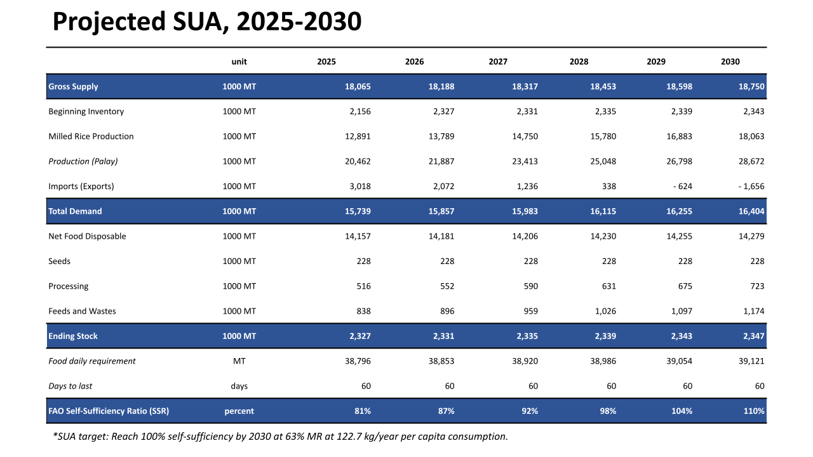{width="100%"}

## Reaching Sufficiency through demand management {.tiny-text}

```{r}
#| echo: false

suff_percap <-  read_csv("diffpercap.csv") |> 
  pivot_longer(-c(mr,percap),
               names_to = c("var","year"),
               names_sep = '_',
               values_to = "value") |> 
  mutate(Yr = factor(year,levels = c(2024,2025,2026,2027,2028,2029,2030)
  )) |> 
  pivot_wider(names_from=var,
              values_from=value)

label_data <- suff_percap %>%
  group_by(percap) %>%
  # arrange(Yr) |> 
  slice_tail(n = 1)


plot_ly(data = suff_percap |> 
          filter(mr==0.63),
        x=~Yr,
        height=600,
        width=1000) |> 
  add_trace(y=~`Sufficiency Ratio`,
            color = ~factor(percap), type = 'scatter', mode = 'lines') |> 
  layout(
    # title =  " Rice Self Sufficiency levels at different Per capita consumption",
    yaxis = list(title = "Rice Self Sufficiency Ratios (%)"),
    hovermode = 'x unified',
    xaxis = list(title = "Year"),
    legend = list(x = 0.05, y = 0.95,
                  title = list(text = "<b>Per Capita Consumption (kg/yr)</b>"),
                  bgcolor = 'rgba(255, 255, 255, 0.4)',
                      orientation = "v",                     # vertical orientation (default)
                  tracegroupgap = 2,                     # optional spacing between groups
                  xanchor = "left",
                  x = 1.02,
                  y = 1,
                  itemsizing = "constant",
                  traceorder = "normal"),
    margin = list(r = 80)
    ) |> 
  config(displayModeBar=FALSE)


```

## 

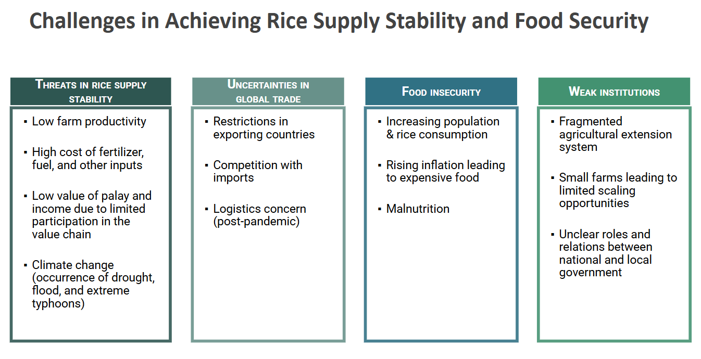{width="100%"}

## 

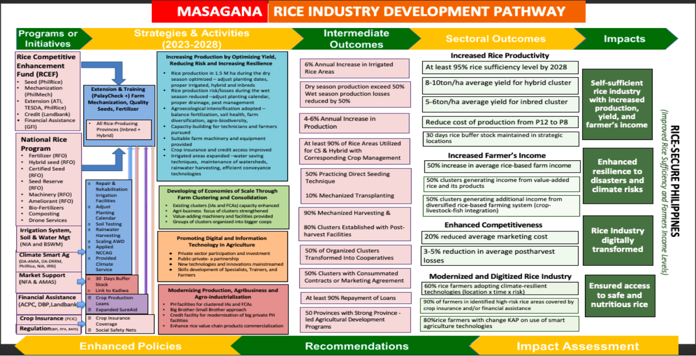{width="100%"}

## 

::::: thank-you
::: {style="font-size: 2.5em; font-weight: bold; text-align: center;"}
Thank You!!
:::

::: {style="margin-top: 1em; font-size: 1.2em; text-align: center;"}
Questions or feedback?<br> <strong>philrice.dataanalytics\@gmail.com</strong>
:::
:::::

<!-- ## Needed government investment to provide 20 P/kg Rice in the market {.extra-tiny-text} -->

<!-- ::: tiny-text -->

<!-- ```{r} -->

<!-- library(openxlsx) -->

<!-- price_scenarios <- read.xlsx("peso20budget.xlsx", -->

<!--                              sheet=1) |>  -->

<!--   mutate_if(is.numeric, -->

<!--             round,digits=2) |>  -->

<!--   mutate_if(is.numeric, -->

<!--             format,nsmall=2) -->

<!-- budget_scenarios <- read.xlsx("peso20budget.xlsx", -->

<!--                               sheet=2) |> -->

<!--   mutate_if(is.numeric, -->

<!--             round,digits=2) |>  -->

<!--   mutate_if(is.numeric, -->

<!--             format,nsmall=2) -->

<!-- price_scenario_labels <- data.frame(Item = "Farmgate and Wholesale prices", -->

<!--                                     A=NA, -->

<!--                                     B=NA, -->

<!--                                     C=NA, -->

<!--                                     D=NA) -->

<!-- budget_scenario_labels <- data.frame(Item = "Required budget to subsidize the following quantity scenarios", -->

<!--                                     A=NA, -->

<!--                                     B=NA, -->

<!--                                     C=NA, -->

<!--                                     D=NA) -->

<!-- merged_x <- data.frame( -->

<!--   Item = 'Required budget to subsidize the following quantity scenarios:', -->

<!--   A = 'In Billion Pesos', -->

<!--   B = '', -->

<!--   C = '', -->

<!--   D = '' -->

<!-- ) -->

<!-- combined_table <-  -->

<!--   rbind( -->

<!--   price_scenarios, -->

<!--   "", -->

<!--   merged_x, -->

<!--   budget_scenarios -->

<!-- ) -->

<!-- datatable( -->

<!--   combined_table, -->

<!--   rownames=FALSE, -->

<!--   container = htmltools::withTags(table( -->

<!--     class = 'display', -->

<!--     thead( -->

<!--       tr( -->

<!--         th(colspan = 1, "Farmgate and Wholesale prices"), -->

<!--         th(colspan = 4, "Price per kg") -->

<!--       ) -->

<!--     ) -->

<!--   )), -->

<!--     options = list( -->

<!--       paging = FALSE, -->

<!--       dom='t', -->

<!--           headerCallback = JS( -->

<!--       "function(thead, data, start, end, display) {", -->

<!--       "  // Only center the second merged header cell", -->

<!--       "  $(thead).find('th').eq(1).css({'text-align': 'center'});", -->

<!--       "}" -->

<!--     ), -->

<!--                 rowCallback = JS( -->

<!--               "function(row, data, index) {", -->

<!--               "  if(data[0] === 'Required budget to subsidize the following quantity scenarios:') {", -->

<!--               "    // Style A cell", -->

<!--               "    $('td', row).eq(0).css({'font-weight':'bold'});", -->

<!--               "    // Merge A to D", -->

<!--               "    $('td', row).eq(1).attr('colspan', 4);", -->

<!--               "    $('td', row).eq(1).css({'text-align':'center', 'font-weight':'bold'});", -->

<!--               "    // Hide the other cells after merge", -->

<!--               "    $('td', row).eq(2).hide();", -->

<!--               "    $('td', row).eq(3).hide();", -->

<!--               "    $('td', row).eq(4).hide();", -->

<!--               "  } else {", -->

<!--               "    // Indent values in column A (except 'Group A')", -->

<!--               "    $('td', row).eq(0).css({'padding-left': '20px'});", -->

<!--               "  }", -->

<!--               "}" -->

<!--             ) -->

<!--     ) -->

<!-- ) -->

<!-- ``` -->
